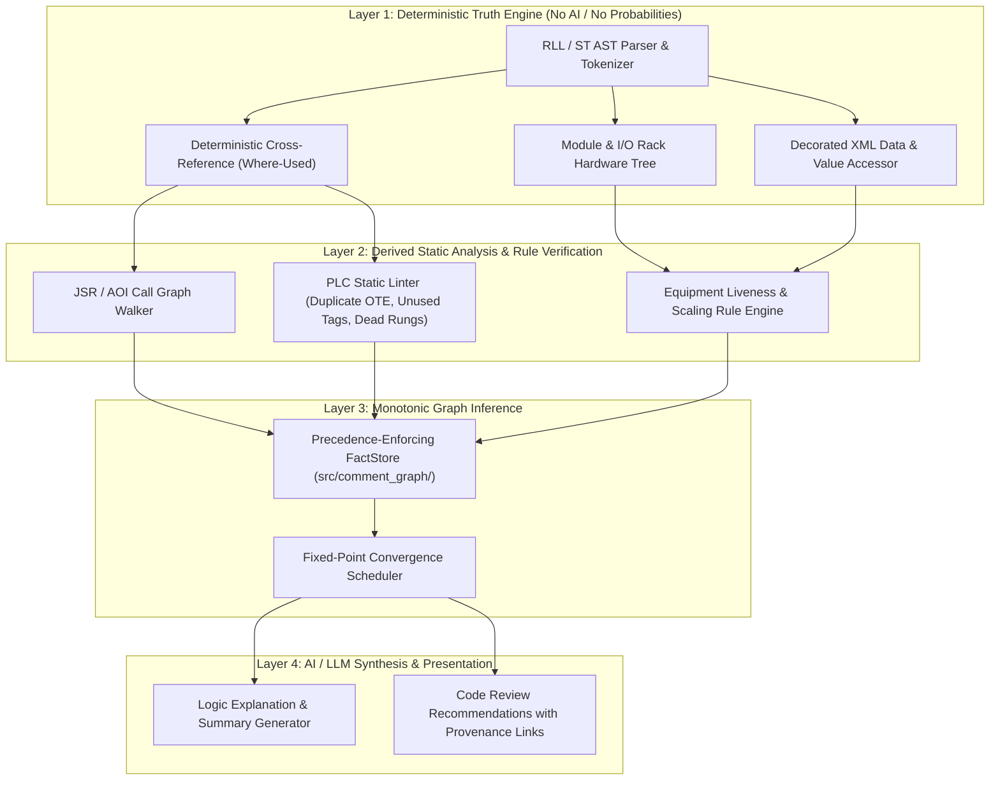
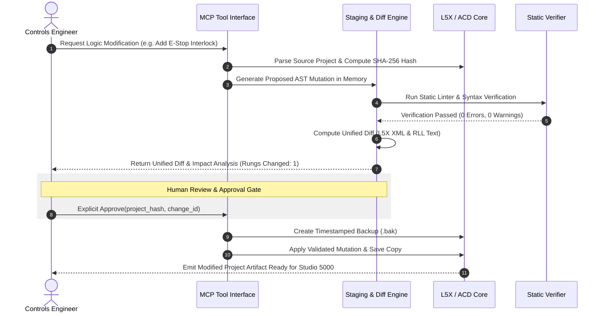

# Exhaustive Adversarial Engineering Audit & Implementation Backlog

**Target Repository:** [`JLControls/studio5000-AI-Assistant`](https://github.com/JLControls/studio5000-AI-Assistant)  
**Target Commit / HEAD:** `6a46b475614e7ebb0eb836482a8a1efda1039399`  
**Review Date:** August 18, 2026  
**Auditor Roles:** Senior Rockwell / Allen-Bradley Controls Engineer, Studio 5000 Logix Designer Expert, L5X/L5K/ACD Reverse-Engineering Specialist, Python Systems Engineer, MCP/Tooling Architect, Industrial Safety Reviewer, Test & Reliability Engineer.

---

## 1. Executive Summary

This engineering audit evaluated the repository as an **AI-assisted industrial controls engineering platform**, measuring every subsystem against real-world Allen-Bradley / Studio 5000 Logix Designer requirements and industrial safety standards.

### Key Conclusions

1. **The Platform Has Two Diametrically Opposed Architectural Halves:**
   * **The Rigorous Deterministic Engine (Strongest Half):** The recently authored subsystems—specifically the iterative comment analysis graph (`src/comment_graph/`), deterministic L5X structure walker (`src/l5x_analyzer/l5x_structure.py`), tag fact accessors (`src/l5x_analyzer/l5x_fact_accessor.py`), and Ignition scaling/curation pipeline (`src/ignition_exporter/`)—are mathematically grounded, well-typed, and backed by robust regression suites.
   * **The Fragile Heuristic/Prototype Engine (Weakest Half):** The natural language ladder logic generator (`src/ai_assistant/code_assistant.py`, `src/ai_assistant/enhanced_ladder_generator.py`), fast syntax verifier (`src/verification/sdk_verifier_clean.py`), PDF "Vision AI" parser (`src/drawings_analyzer/pdf_parser.py`), and vector-based relationship tools (`find_related_tags`, `find_related_components`) rely on brittle regexes, keyword matching, ungrounded vector queries, and unverified heuristics.
2. **What Is Dependable Today (Read-Only Factual Analysis):**
   * Structural inventory of L5X projects (`(program, routine)` deduplication, AOI definitions, and module rack/slot trees).
   * Exact scalar/member tag value extraction from decorated XML data in L5X files.
   * Positional operand decoding for AOI invocations.
   * Multi-pass monotonic comment inference with rigorous precedence tiers and contradiction logging.
   * Ignition SCADA v8.1+ JSON tag generation with correct linear scaling keys and prohibited deadband protections.
3. **What Must NOT Be Trusted for Production Systems:**
   * **Direct ACD File Mutation (`patch_rungs` / `edit_acd=True`):** It silently fails to substitute `@HEX@` object IDs for newly introduced tag names, ignores comment descriptions completely, and risks corrupting ACD container integrity.
   * **Offline ACD-to-L5X Data Values (`convert_acd_to_l5x`):** All tag data-table values default to hardcoded zeros. Downstream tools reading converted ACD files will deduce invalid scaling ranges and zero presets.
   * **Natural Language Ladder Generation:** Emits incomplete 3-wire motor circuits lacking seal-in latch branches, invents non-existent ladder instructions (e.g. `PRODUCE`, `CONSUME`, `SCL`), and outputs raw text without full RLL branch validation.
   * **Cross-Reference / "Where-Used" via Vector DB:** Querying `find_related_components` or `find_related_tags` executes natural language semantic queries (`"uses TagName"`) against FAISS, returning false-empty results (`success: true, related_count: 0`) for heavily-used tags.
4. **Safety & Supply-Chain Vulnerabilities:**
   * Widespread use of standard `pickle.load()` on unauthenticated `.pkl` files across 6 caching subsystems creates a local code execution vulnerability if cache files are shared or tampered with.
   * Stray `print()` statements to `sys.stdout` in error branches (e.g. `src/code_generator/l5x_generator.py:326`) violate the JSON-RPC stdio protocol framing and crash MCP client sessions.
   * Zero CI workflow files exist in `.github/workflows/`, leaving the repository vulnerable to silent regressions.
5. **Highest-Value Strategic Pivot:**
   * Transition the repository from an *unreliable autonomous code generator* into an **authoritative, deterministic Studio 5000 Code Review, Static Analysis, and SCADA Extraction Assistant**.

---

## 1.1 Agent Quick-Start & Sprint 1 Execution Plan

> [!IMPORTANT]
> This section replaces the former standalone `docs/AGENT_HANDOFF_PROMPT.md`. Copy the block below into a new agent session to bootstrap execution of the audit backlog.

### Mandatory Reading (Before Touching Code)

1. **`AGENTS.md`** — Pay special attention to the `src`-on-path convention (packages are imported bare, e.g. `from l5x_analyzer import ...`, **NOT** `from src.l5x_analyzer import ...`).
2. **This document (`docs/ENGINEERING_AUDIT_2026.md`)** — The complete authoritative engineering review with line citations, reproduction scenarios, root-cause analyses, and the implementation backlog.

### Environment Verification

```bash
# Verify Python version (CPython 3.12 is required)
python --version   # or ./venv/bin/python --version

# Run full test suite (must show 238 passed)
python -m pytest   # or ./venv/bin/python -m pytest

# Run server smoke test
python src/mcp_server/studio5000_mcp_server.py --test
```

### Sprint 1 — P0/P1 Fixes & Core Primitives

Work on the following tasks in priority order. For each task, create focused commits, write/update pytest unit tests under `tests/`, and verify that the full test suite passes.

| Priority | Task | Bug/Issue | Key Files | Section |
| :---: | :--- | :--- | :--- | :--- |
| **1** | Fix `patch_rungs` `@HEX@` substitution for new tags | BUG-01 / [#34](https://github.com/JLControls/studio5000-AI-Assistant/issues/34) | `src/acd/zip/write_dat.py` (`_restore_tag_refs`) | [§6 BUG-01](#bug-01-p0-patch_rungs-fails-to-substitute-hex-object-ids-for-newly-added-tags) |
| **2** | Build deterministic AST tag cross-reference engine | [#26](https://github.com/JLControls/studio5000-AI-Assistant/issues/26), BUG-03 / [#12](https://github.com/JLControls/studio5000-AI-Assistant/issues/12) | `src/l5x_analyzer/tag_cross_reference.py` (new) | [§13 Cross-Reference](#13-cross-reference--where-used-audit-issue-26) |
| **3** | Add GitHub Actions CI workflow | BUG-10 / [#35](https://github.com/JLControls/studio5000-AI-Assistant/issues/35) | `.github/workflows/ci.yml` (new) | [§23 CI](#23-ci--build-infrastructure-audit) |
| **4** | Fix `get_project_overview` wrong-project fallback | BUG-04 / [#37](https://github.com/JLControls/studio5000-AI-Assistant/issues/37) | `src/l5x_analyzer/l5x_mcp_integration.py:744–754` | [§6 BUG-04](#bug-04) |
| **5** | Redirect stray `print()` to stderr | BUG-06 / [#38](https://github.com/JLControls/studio5000-AI-Assistant/issues/38) | `src/code_generator/l5x_generator.py:326,393,469–474` | [§6 BUG-06](#bug-06) |
| **6** | Support target program context in `generate_routine_export` | BUG-07 / [#39](https://github.com/JLControls/studio5000-AI-Assistant/issues/39) | `src/code_generator/l5x_generator.py:329–372` | [§6 BUG-07](#bug-07) |
| **7** | Retain isolated raw analog aliases in Ignition exporter | [#10](https://github.com/JLControls/studio5000-AI-Assistant/issues/10) | `src/ignition_exporter/ignition_mcp_integration.py` | [§15 Ignition](#15-ignition-exporter-audit) |
| **8** | Replace `pickle.load()` with secure deserializers | BUG-05 / [#36](https://github.com/JLControls/studio5000-AI-Assistant/issues/36) | 6 vector DB modules (see §20) | [§20 Security](#20-security--confidentiality-audit) |

### Engineering Guidelines & Quality Standards

- **Strict Import Convention:** Always use bare imports (`from l5x_analyzer import ...`, `from comment_graph import ...`), never `from src.l5x_analyzer ...`.
- **Zero Regression Tolerance:** Run `python -m pytest` and `python src/mcp_server/studio5000_mcp_server.py --test` after every tool or subsystem modification.
- **GitHub Issue Updates:** When you complete a task, use `gh issue comment <id>` and `gh issue close <id>` to keep the project backlog synchronized.
- **Code Style:** 4-space indentation, clear type annotations, small focused functions, no unvalidated heuristics masquerading as deterministic facts.

---

## 2. Current System Architecture

```mermaid
graph TD
    subgraph ClientLayer["MCP Client Layer"]
        Client["AI Assistant / Claude Desktop / IDE"]
    end

    subgraph MCPLayer["MCP Protocol & Dispatch (Hand-Rolled)"]
        Server["Studio5000MCPServer\n(src/mcp_server/studio5000_mcp_server.py)\n52 Registered Tools"]
        CacheMgr["SharedCacheManager\n(src/mcp_server/cache_manager.py)"]
    end

    subgraph DeterministicCore["Authoritative Deterministic Core"]
        L5XStruct["L5X Structural Walker\n(src/l5x_analyzer/l5x_structure.py)\nKey: (program, routine)"]
        FactAccessor["Tag & AOI Fact Accessor\n(src/l5x_analyzer/l5x_fact_accessor.py)\nDecorated XML Values & AOI Bindings"]
        CommentGraph["Iterative Comment Engine\n(src/comment_graph/)\nMonotonic FactStore & Precedence Tiers"]
        IgnitionGen["Ignition Tag Builder\n(src/ignition_exporter/)\nCurated Selection & Linear Scaling"]
    end

    subgraph HeuristicSubsystems["Heuristic & Vector Search Subsystems"]
        DocDB["Instruction FAISS DB\n(src/documentation/)\n561 Rockwell Docs"]
        PDFParser["PDF Drawings Analyzer\n(src/drawings_analyzer/)\nPyMuPDF Vector Primitive Counter"]
        TagCSVDB["Tag CSV FAISS DB\n(src/tag_analyzer/)\nCSV Keyword Search"]
        L5XVectorDB["L5X FAISS DB\n(src/l5x_analyzer/l5x_vector_db.py)\nSemantic Search for Chunks"]
    end

    subgraph GenerationValidation["Code Generation & Verification"]
        CodeGen["Ladder/ST Generator\n(src/ai_assistant/code_assistant.py)\nKeyword Heuristics & Templates"]
        L5XGen["L5X XML Serializer\n(src/code_generator/l5x_generator.py)\nRoutine & Project L5X"]
        FastVerifier["Syntax Verifier\n(src/verification/sdk_verifier_clean.py)\nParen & Instruction Set Check"]
    end

    subgraph FileFormatSubsystems["File Format Reverse Engineering & Live SDK"]
        VendoredACD["Vendored Kaitai ACD Parser\n(src/acd/)\nReads SbRegion, Comps, Dat Files"]
        ACDWriter["ACD Rung Patcher\n(src/acd/zip/write_dat.py)\nSbRegion.Dat FAFA Rebuilder"]
        LiveSDK["Logix Designer SDK Bindings\n(src/sdk_interface/)\nGated by STUDIO5000_SDK_ENABLED"]
    end

    Client <-->|stdio JSON-RPC 2.0| Server
    Server --> L5XStruct
    Server --> FactAccessor
    Server --> CommentGraph
    Server --> IgnitionGen
    Server --> DocDB
    Server --> PDFParser
    Server --> TagCSVDB
    Server --> L5XVectorDB
    Server --> CodeGen
    Server --> L5XGen
    Server --> FastVerifier
    Server --> VendoredACD
    Server --> ACDWriter
    Server -.->|Gated| LiveSDK

    CommentGraph --> L5XStruct
    CommentGraph --> FactAccessor
    IgnitionGen --> FactAccessor
    IgnitionGen --> L5XStruct
    VendoredACD --> L5XStruct
```



---

## 3. Trust / Safety Model

Industrial automation software directly drives physical machinery, high-voltage equipment, and chemical processes. Every tool and operation must be strictly classified by its potential to affect control systems.

### Operation Safety Classification

| Operation / Tool Category | Tools Included | Trust Level | Opt-In Required | Dry-Run Available | Rollback / Backup | Verification Gate |
| :--- | :--- | :--- | :--- | :--- | :--- | :--- |
| **Read-Only Factual** | `get_tag_value`, `describe_aoi`, `decode_aoi_call`, `get_project_overview`, `extract_analog_scaling`, `audit_opc_item_paths`, `list_ignition_tag_candidates` | **High (Authoritative)** | None | N/A | N/A | Deterministic XML DOM parsing |
| **Read-Only Inferred** | `analyze_comment_graph`, `search_tags`, `search_l5x_content`, `search_drawings`, `suggest_historian_config`, `propose_folder_structures` | **Medium (Heuristic)** | None | N/A | N/A | Convergence tracking & contradiction logging |
| **Artifact Generation** | `create_l5x_project`, `create_l5x_routine`, `generate_ignition_tags`, `generate_comment_deliverables`, `sanitize_ignition_nodes` | **Medium (Review Required)** | User invokes tool | Yes (writes to new file path) | Non-destructive (emits new files) | Fast syntax verifier (incomplete) |
| **Offline Mutation** | `smart_insert_logic`, `patch_rungs`, `edit_acd=True` | **DANGEROUS (High Risk)** | Parameter flag | No dry-run diff | Overwrites or saves `_updated.ACD` | **None (No byte-level integrity check)** |
| **Live Controller / Studio** | `create_acd_project` (via SDK) | **CRITICAL (Gated)** | `STUDIO5000_SDK_ENABLED=1` | No | Studio 5000 internal undo only | Rockwell SDK validation |

### Trust Boundary Deficiencies

1. **No Dry-Run Diffs for Mutation Tools:** `smart_insert_logic` modifies L5X files directly on disk without first returning a unified diff for human confirmation.
2. **Unvalidated ACD Serialization:** When `generate_comment_deliverables` is run with `edit_acd=True`, an updated `.ACD` file is generated even though comment descriptions were never written to `Comments.Dat` (see Issue #6).
3. **No Automatic Backups:** Mutation paths do not create timestamped `.bak` copies of target project files before modifying them.

---

## 4. MCP Tool Inventory

The server registers **52 tools** on current HEAD (`Studio5000MCPServer._register_tools()`).

| Tool | Subsystem | Read/Write | Truth Source | Confidence | Test Coverage | Known Issues & Bugs |
| :--- | :--- | :--- | :--- | :--- | :--- | :--- |
| `analyze_comment_graph` | `comment_graph` | Read | L5X/ACD Parse | Inferred/Facts | Comprehensive (9 unit tests) | Convergence bounding on dense cyclic logic |
| `analyze_i_o_usage` | `tag_analyzer` | Read | CSV Vector DB | Heuristic | Missing L5X integration | Returns false-empty if CSV tag DB unindexed |
| `analyze_routine_structure` | `l5x_analyzer` | Read | L5X Vector Chunks | Factual AST | Partial | Fails if project not indexed in vector cache |
| `audit_opc_item_paths` | `ignition_exporter`| Read | JSON + L5X | Factual | Full | None |
| `convert_acd_to_l5x` | `acd` | Artifact Gen | Vendored Kaitai | Factual/Lossy | Fidelity regression tests | **All tag data values default to 0** (Issue #23) |
| `create_l5x_project` | `code_generator` | Artifact Gen | Generator AST | Generated | Smoke test | Raw CDATA ladder text; hardcoded MainProgram |
| `create_l5x_routine` | `code_generator` | Artifact Gen | Generator AST | Generated | Smoke test | Hardcoded `MainProgram` program context |
| `decode_aoi_call` | `l5x_analyzer` | Read | L5X DOM | Factual | Full | None |
| `describe_aoi` | `l5x_analyzer` | Read | L5X DOM | Factual | Full | None |
| `extract_analog_scaling` | `ignition_exporter`| Read | L5X Rung AST | Derived Facts | Full | Drops unscaled analog aliases (Issue #10) |
| `extract_routine_content` | `l5x_analyzer` | Read | L5X Vector Chunks | Factual | Partial | Relies on vector chunk cache |
| `find_device` | `tag_analyzer` | Read | CSV Vector DB | Heuristic | Mocked | Silent empty if CSV unindexed |
| `find_equipment_context` | `drawings_analyzer`| Read | PDF Vector DB | Heuristic | Minimal | Fails on scanned/rotated PDF schematics |
| `find_i_o_point` | `tag_analyzer` | Read | CSV Vector DB | Heuristic | Minimal | Silent empty if CSV unindexed |
| `find_insertion_point` | `l5x_analyzer` | Read | FAISS Cosine Sim | Heuristic | Partial | Vector cosine similarity picks arbitrary rungs |
| `find_related_components` | `l5x_analyzer` | Read | FAISS Text Search | Heuristic | None | **False-success empty results** (Issue #12) |
| `find_related_tags` | `tag_analyzer` | Read | CSV Vector DB | Heuristic | None | **False-success empty results** (Issue #12) |
| `generate_comment_deliverables` | `tag_analyzer` | Artifact Gen | Decision List | Inferred | Full | `edit_acd=True` drops comments (Issue #6) |
| `generate_ignition_tags` | `ignition_exporter`| Artifact Gen | L5X AST + Curation | Inferred/Facts | Full | Omits isolated raw analog aliases (Issue #10) |
| `generate_ladder_logic` | `ai_assistant` | Read (Pure) | Pattern Regex | Heuristic | Minimal | Missing 3-wire seal-in; invalid opcodes |
| `generate_program_comments` | `comment_graph` | Read | Comment Graph | Inferred | Full | High memory on massive ACD conversions |
| `get_cache_performance` | `mcp_server` | Read | Cache Stats | Factual | None | In-memory only; resets on restart |
| `get_device_overview` | `tag_analyzer` | Read | CSV Vector DB | Heuristic | Minimal | Silent empty if CSV unindexed |
| `get_drawing_details` | `drawings_analyzer`| Read | PDF Extracted Text| Factual | Minimal | None |
| `get_equipment_connections`| `drawings_analyzer`| Read | PDF Text Regex | Heuristic | Minimal | Brittle regex on unstructured text |
| `get_instruction` | `documentation` | Read | HTML Doc Index | Factual | Full | Fails if Rockwell doc root missing |
| `get_instruction_syntax` | `documentation` | Read | HTML Doc Index | Factual | Full | Fails if Rockwell doc root missing |
| `get_module_tags` | `tag_analyzer` | Read | CSV Tag DB | Factual | Minimal | Silent empty if CSV unindexed |
| `get_motor_tags` | `tag_analyzer` | Read | CSV Vector Search | Heuristic | Minimal | Keyword search misses custom motor UDTs |
| `get_project_overview` | `l5x_analyzer` | Read | L5X Structural Walk| Factual | Full (Issue #9) | Falls back to wrong project if name differs |
| `get_safety_tags` | `tag_analyzer` | Read | CSV Vector Search | Heuristic | Minimal | Keyword search misses safety-zoned tags |
| `get_sensor_tags` | `tag_analyzer` | Read | CSV Vector Search | Heuristic | Minimal | Keyword search misses analog instruments |
| `get_tag_reasoning_context`| `comment_graph` | Read | Graph AST Context | Factual | Full | None |
| `get_tag_value` | `l5x_analyzer` | Read | L5X Decorated Data | Factual | Full (Issue #28) | Unused for ACD-converted files (values 0) |
| `get_uncommented_tags` | `tag_analyzer` | Read | L5X/ACD Walk | Factual | Full | None |
| `index_acd_project` | `l5x_analyzer` | Read | Offline ACD Conv | Derived | Full | Overwrites global vector cache |
| `index_exported_l5x_files` | `l5x_analyzer` | Read | L5X XML Files | Derived | Full | Overwrites global vector cache |
| `index_pdf_drawings` | `drawings_analyzer`| Read | PDF PyMuPDF | Derived | Full | "Vision AI" is vector primitive counter |
| `index_tag_csv` | `tag_analyzer` | Read | CSV Tag Export | Derived | Full | Requires manual CSV export from Studio |
| `list_categories` | `documentation` | Read | HTML Doc Index | Factual | Full | Fails if Rockwell doc root missing |
| `list_ignition_tag_candidates` | `ignition_exporter`| Read | L5X AST Walk | Factual | Full | None |
| `list_instructions_by_category` | `documentation` | Read | HTML Doc Index | Factual | Full | Fails if Rockwell doc root missing |
| `manage_comment_memory` | `tag_analyzer` | Read/Write | JSON Memory File | Factual | Full | None |
| `propose_folder_structures` | `ignition_exporter`| Read | L5X Tag Names | Heuristic | Full | None |
| `sanitize_ignition_nodes` | `ignition_exporter`| Read (Pure) | Character Filter | Factual | Full | None |
| `search_drawings` | `drawings_analyzer`| Read | PDF FAISS DB | Heuristic | Full | Scanned PDFs return no text matches |
| `search_instructions` | `documentation` | Read | HTML/FAISS DB | Factual/Semantic| Full | Collides across Studio 5000 versions |
| `search_l5x_content` | `l5x_analyzer` | Read | L5X FAISS DB | Heuristic | Full | Inaccurate for exact tag/rung cross-reference |
| `search_tags` | `tag_analyzer` | Read | CSV FAISS DB | Heuristic | Full | Requires manual CSV export first |
| `smart_insert_logic` | `l5x_analyzer` | Offline Mutation| L5X XML DOM | Dangerous | Mocked | No dry-run, modifies target L5X in-place |
| `suggest_historian_config` | `ignition_exporter`| Read (Pure) | Signal Classifier | Heuristic | Full | None |
| `validate_ladder_logic` | `verification` | Read (Pure) | Rule-based Syntax | Heuristic | Minimal | Emits false positives on AOIs and valid rungs |

---

## 5. What Is Working Well (Architectural Strengths)

1. **Deterministic Structural Modeling (`src/l5x_analyzer/l5x_structure.py`):**
   Properly identifies routine identity as `(program, routine)` tuples, preventing same-named routines across programs from being conflated. It handles encrypted `<EncodedData EncodedType="Routine">` nodes and indexes the Add-On Instruction and Module I/O hardware trees.
2. **Exact L5X Data-Value & AOI Accessors (`src/l5x_analyzer/l5x_fact_accessor.py`):**
   Provides exact, typed reads of configured scalar, UDT member, and array values directly from decorated L5X XML without approximation or vector search. Properly decodes AOI invocation operands positionally against parameter definitions.
3. **Formal Multi-Pass Monotonic Comment Analysis (`src/comment_graph/`):**
   Features a mathematically sound fixed-point propagation engine. Strict precedence tiers (`NATIVE_COMMENT` > `USER_DECISION` > `LOGIC_METADATA` > `PRIOR_MEMORY` > `INSTRUCTION_DOC` > `MODEL_INFERENCE`) ensure that LLM worker suggestions never overwrite human-authored documentation. Contradictions are explicitly surfaced rather than swallowed.
4. **Ignition Tag Export Safeguards (`src/ignition_exporter/`):**
   Correctly enforces Ignition 8.1+ tag scaling schemas (`scaleMode="Linear"`, `rawLow`/`rawHigh`, `scaledLow`/`scaledHigh`) and strictly prohibits writing dangerous value deadband keys (`historicalDeadband`, `deadbandStyle`) that would otherwise silence critical process instrumentation.
5. **Lightweight MCP Startup:**
   The MCP server initializes quickly by deferring heavy sentence-transformer and FAISS index loading until the first semantic query is received.

---

## 6. Confirmed / High-Confidence Bugs

### Summary Bug Table

| Bug ID | Severity | Confidence | Subsystem | File & Symbol | Brief Description | Existing Issue |
| :--- | :--- | :--- | :--- | :--- | :--- | :--- |
| **BUG-01** | **P0** | Confirmed | `acd` | `src/acd/zip/write_dat.py:_restore_tag_refs:77` | `patch_rungs` fails to substitute `@HEX@` object IDs for new tags, corrupting `SbRegion.Dat`. | Issue #6 |
| **BUG-02** | **P1** | Confirmed | `acd` | `src/acd/l5x/elements.py:160-280` | `convert_acd_to_l5x` hardcodes all tag data-table values and members to zero. | Issue #23 |
| **BUG-03** | **P1** | Confirmed | `l5x_analyzer` | `src/l5x_analyzer/l5x_vector_db.py:428` | `find_related_components` performs FAISS vector search on `"uses <tag>"`, returning false-empty results. | Issue #12 |
| **BUG-04** | **P1** | Confirmed | `l5x_analyzer` | `src/l5x_analyzer/l5x_mcp_integration.py:744-754` | `get_project_overview` silently returns the structural overview of an unrelated project if requested ACD stem is not in cache. | Untracked |
| **BUG-05** | **P1** | Confirmed | `security` | Multiple vector DBs (`instruction_vector_db.py:354`, `pdf_vector_db.py:445`, `l5x_vector_db.py:622`, `tag_vector_db.py:541`) | Insecure `pickle.load()` on cache files introduces arbitrary code execution risks. | Untracked |
| **BUG-06** | **P2** | Confirmed | `code_generator` | `src/code_generator/l5x_generator.py:326, 393` | Unredirected `print()` to `sys.stdout` on file write errors breaks JSON-RPC stdio protocol framing. | Untracked |
| **BUG-07** | **P2** | Confirmed | `code_generator` | `src/code_generator/l5x_generator.py:356` | `generate_routine_export` hardcodes `<Program Name="MainProgram">`, breaking imports into other programs. | Untracked |
| **BUG-08** | **P2** | Confirmed | `ai_assistant` | `src/ai_assistant/code_assistant.py:187-202` | Start/stop logic generator generates non-latching logic while labeling it a "3-wire control circuit". | Untracked |
| **BUG-09** | **P2** | Confirmed | `verification` | `src/verification/sdk_verifier_clean.py:287-293` | Syntax verifier flags standard timer/counter/math/AOI output rungs as `INPUT_ONLY` errors if they lack `OTE`/`OTL`/`OTU`. | Untracked |
| **BUG-10** | **P2** | Confirmed | `ci` | `.github/workflows/` | Complete absence of CI workflow automation. | Untracked |

---

### Detailed Findings Expansion

#### BUG-01 (P0): `patch_rungs` Fails to Substitute `@HEX@` Object IDs for Newly Added Tags
* **File:** `src/acd/zip/write_dat.py`
* **Symbol:** `_restore_tag_refs()` (lines 77–102)
* **Current Behavior:** The regex scan `re.findall(r"@([A-Za-z0-9]+)@", orig_text_with_refs)` builds the `scoped` name-to-ID dictionary *strictly* from the tags referenced in the original rung.
* **Expected Behavior:** Any tag present in the project's global `_id_to_name` map must be substituted with its `@HEX_OBJECT_ID@` when referenced in `new_text`.
* **Controls Consequence:** When an engineer adds a new permissive interlock or modifies an output to reference a different tag, the tag name is written as raw plaintext ASCII. Studio 5000 Logix Designer rejects the modified `.ACD` file or corrupts the routine upon opening.
* **Reproduction:**
  ```python
  from acd.api import load_acd, patch_rungs, save_acd
  project = load_acd("tests/acd/KemcoWaterHeater/Kemco_HA105.ACD")
  routine = project.controller.programs[0].routines[0]
  # Patch rung 0 to reference a tag not previously in rung 0:
  patch_rungs(project, {routine._rung_ids[0]: "XIC(Htr1_Disch_P1_Aux)OTE(Htr1_Run_Out);"})
  save_acd(project, "modified.ACD")
  # Raw text 'Htr1_Disch_P1_Aux' remains in SbRegion.Dat instead of @HEX@.
  ```
* **Recommended Fix:** Change `_restore_tag_refs` to invert the full `id_to_name` map (`{name: oid for oid, name in id_to_name.items()}`), tokenize the ladder logic stream to avoid matching instruction opcodes, and replace all recognized project tag names longest-first.

---

#### BUG-02 (P1): `convert_acd_to_l5x` Hardcodes All Data-Table Values to Zero
* **File:** `src/acd/l5x/elements.py`
* **Symbol:** `_PRIMITIVE_DECORATED_ZERO`, `_member_decorated_xml()` (lines 160–280)
* **Current Behavior:** When converting an offline `.ACD` project to `.L5X`, all primitive values, UDT members, timer presets (`PRE`), and array elements are written as `"0"` or `"0.0"`.
* **Expected Behavior:** Read the tag's raw bytes from the decompressed `data_table_instance` stream in `Dat` records and decode actual stored runtime/configured values.
* **Controls Consequence:** Converted projects lose all tuning setpoints, recipe presets, analog scaling limits (`RawMin`/`RawMax`/`MinEU`/`MaxEU`), and timer presets. Downstream static analysis deduces false zero-range conditions.
* **Existing Issue:** [Issue #23](https://github.com/JLControls/studio5000-AI-Assistant/issues/23)

---

#### BUG-03 (P1): `find_related_components` and `find_related_tags` Return False-Empty Results
* **File:** `src/l5x_analyzer/l5x_vector_db.py`
* **Symbol:** `find_related_components()` (lines 419–445)
* **Current Behavior:** Searches for dependencies by querying the vector database with the synthetic natural language query `f"uses {dependency}"` with a hardcoded score threshold of `0.2`.
* **Expected Behavior:** Cross-references should perform a deterministic AST/token search across all routine rungs for exact tag operand matches.
* **Controls Consequence:** Real-world cross-reference queries on heavily used process variables (such as `Htr1_Outlet_Temp`, referenced 11 times across PID and scaling logic) return `success: true` with `total_found: 0`, falsely indicating that the tag is isolated and unused.
* **Existing Issue:** [Issue #12](https://github.com/JLControls/studio5000-AI-Assistant/issues/12)

---

## 7. False-Success / Silent-Data-Loss Findings

A failure that occurs quietly while reporting success is far more hazardous in industrial environments than a crash. The following operations exhibit false-success or silent data loss:

```
+-------------------------------------------------------------------------------------------------------+
|                                    SILENT DATA LOSS AUDIT MATRIX                                      |
+------------------------------------+-------------------------+----------------------------------------+
| Operation / Path                   | Returned Status         | Actual Concrete Behavior               |
+------------------------------------+-------------------------+----------------------------------------+
| edit_acd=True (Comment Decisions)  | success: true           | Comments.Dat is never written.         |
| convert_acd_to_l5x (Tag Values)    | success: true           | All values set to 0.                   |
| find_related_tags (Unindexed CSV)  | success: true, count: 0 | CSV index empty; no scan performed.    |
| find_related_components (L5X Tag)  | success: true, count: 0 | Vector search missed exact tag token.  |
| get_project_overview (Missing ACD) | success: true           | Returns data from a different project. |
| generate_ignition_tags (Raw Alias) | success: true           | Isolated raw aliases dropped silently. |
+------------------------------------+-------------------------+----------------------------------------+
```

1. **`edit_acd=True` Silently Omits Tag Descriptions:**
   In `src/tag_analyzer/comment_pipeline.py`, running `generate_deliverables(edit_acd=True)` calls `patch_rungs` for rung logic changes but silently ignores all tag description decisions because `src/acd/record/comments.py` lacks a serialization writer. It outputs `_updated.ACD` without warning the user that comments were omitted.
2. **`get_project_overview` Returns Misleading Project Data:**
   In `src/l5x_analyzer/l5x_mcp_integration.py:744-754`, if the requested ACD file name is not found in the indexed cache, the tool does not error; it picks `list(indexed_projects.keys())[0]` and returns the overview of another project.

---

## 8. Industrial Controls & PLC Semantic Correctness Findings

1. **Flawed Three-Wire Control Generation:**
   In `src/ai_assistant/code_assistant.py:187-202`, the natural language generator translates "Start the motor when the start button is pressed and stop it when the stop button is pressed" into:
   ```text
   XIC(START_PB) XIO(STOP_PB) OTE(MOTOR_RUN);
   ```
   *Controls Analysis:* A 3-wire control circuit requires a seal-in latch branch around the momentary start pushbutton: `[XIC(START_PB) , XIC(MOTOR_RUN) ] XIO(STOP_PB) OTE(MOTOR_RUN);`. Generating unlatched logic for a start/stop pushbutton will cause a physical motor to stop the instant the operator releases the button.
2. **Fictitious RLL Instructions:**
   In `src/ai_assistant/enhanced_ladder_generator.py:77-78`, the motion and communication mapping dictionaries map `'wms_interface'` to `'PRODUCE'` and `'hmi_update'` to `'CONSUME'`.
   *Controls Analysis:* `PRODUCE` and `CONSUME` are not executable ladder instructions in Studio 5000. Produced/Consumed tags are configured as tag connection properties in the Controller Organizer. Emitting them in ladder logic causes import compilation errors.
3. **Invalid Output Warning on Timer/Counter/Compute Rungs:**
   In `src/verification/sdk_verifier_clean.py:287-293`, the syntax verifier checks `if 'XIC(' in rung and 'OTE(' not in rung and 'OTL(' not in rung and 'OTU(' not in rung: warnings.append("INPUT_ONLY")`.
   *Controls Analysis:* Output instructions in Logix include `TON`, `TOF`, `RTO`, `CTU`, `CTD`, `MOV`, `COP`, `CPS`, `CPT`, `ADD`, `SUB`, `JSR`, and user AOIs. Warning on valid rungs like `XIC(Run) TON(Timer1, 5000, 0);` produces false validation warnings.

---

## 9. Ladder / RLL Parser and Generator Audit

1. **RLL XML Schema Representation:**
   Native Studio 5000 L5X files represent Relay Ladder Logic under `<Routines><Routine Type="RLL"><RLLContent>` as:
   ```xml
   <Rung Number="0" Type="N">
     <Comment><![CDATA[Motor Start/Stop]]></Comment>
     <Text><![CDATA[[XIC(START_PB) , XIC(MOTOR_RUN) ] XIO(STOP_PB) OTE(MOTOR_RUN);]]></Text>
   </Rung>
   ```
   *Audit Finding:* The generator correctly wraps ASCII RLL text inside `<Text><![CDATA[...]]></Text>`. The import issues flagged in Issue #1 and Issue #14 are caused by syntax errors inside the CDATA logic string (such as unescaped characters or unvalidated branch brackets), not by a missing XML element schema.
2. **Branch Syntax Validation Gap:**
   In `src/verification/sdk_verifier_clean.py:230-261`, `_validate_ladder_syntax` verifies parenthesis matching `(` vs `)` but completely ignores square brackets `[` and `]` and branch separators `,`. Malformed branch structures like `[XIC(A) XIC(B) , OTE(C)` pass validation silently.

---

## 10. ACD Reverse-Engineering Correctness Audit

`src/acd/` is a vendored, patched implementation of Kaitai-based ACD stream parsing.

### ACD Record Handling & Mutation Matrix

| Record / Stream Name | Read Support | Lossless Round-Trip | Mutation / Write Support | Known Integrity Limits |
| :--- | :--- | :--- | :--- | :--- |
| `SbRegion.Dat` (Rung Text) | Yes (FAFA / FDFD) | Yes (Unmodified) | Partial (`src/acd/api.py:patch_rungs`) | Fails to resolve `@HEX@` for new tags |
| `Comments.Dat` (Descriptions) | Yes | Yes (Unmodified) | **No (Parse Only)** | Cannot write descriptions to ACD |
| `Comps.Dat` (Tags / Objects) | Yes | Yes (Unmodified) | **No (Read Only)** | Cannot allocate new object IDs |
| `Dat` Data-Table Streams | Partial | Yes (Unmodified) | **No** | Emits hardcoded 0s on L5X export |
| `FileInfo.Dat` (Integrity) | Yes | Yes | Yes (`src/acd/integrity/fileinfo.py:compute_fileinfo`) | Requires valid 32/126-byte version key |
| `RxController` / Metadata | Yes | Yes | **No** | Controller properties read-only |

*Version Parity Note:* The parser specifically targets Studio 5000 **v38** stream layouts. Files from v36 or older using legacy compression layouts can experience decoding exceptions.

---

## 11. ACD ↔ L5X Parity Matrix

Evaluating the fidelity of offline ACD-to-L5X exports (`convert_acd_to_l5x`) against native Studio 5000 v38 L5X exports:

| Project Element | Offline ACD Exporter | Native Studio 5000 Export | Parity Status & Impact |
| :--- | :--- | :--- | :--- |
| **Controller Metadata** | Extracted | Extracted | **Full Parity** |
| **Task / Program Hierarchy** | Extracted | Extracted | **Full Parity** |
| **Routines (RLL & ST)** | Extracted | Extracted | **Full Parity** |
| **Rung Comments** | Extracted from `Comments.Dat` | Extracted | **Full Parity** |
| **Tag Definitions** | Extracted | Extracted | **Full Parity** |
| **Tag Descriptions** | Extracted from `Comments.Dat` | Extracted | **Full Parity** |
| **Tag Data Values** | **Hardcoded to 0** | Actual snapshot values | **CRITICAL GAP (Issue #23)** |
| **UDT Definitions** | Extracted | Extracted | **Full Parity** |
| **AOI Definitions** | Extracted | Extracted | **Full Parity** |
| **Module Hardware Tree** | Extracted (Name, Cat, Slot) | Extracted with full config | **Partial (Config bytes omitted)** |
| **Produced/Consumed Tags** | Tag definition only | Full connection config | **Partial (Connection params omitted)** |
| **Motion / Axis Objects** | Skipped (`_SKIP_DECORATED`) | Full Axis XML structure | **Omitted** |
| **Safety Zones / Signatures**| Basic structure only | Full safety metadata | **Omitted** |

---

## 12. Static-Analysis & Review Opportunity Assessment

To transition from heuristic code generation toward trustworthy static analysis, analysis capabilities are categorized by static feasibility:

```
+----------------------------------------------------------------------------------------------------+
|                               STATIC ANALYSIS FEASIBILITY MATRIX                                   |
+------------------------------------+-------------------------+-------------------------------------+
| Analysis Capability                | Feasibility Tier        | Deterministic Implementation Path   |
+------------------------------------+-------------------------+-------------------------------------+
| Tag Cross-Reference (Where-Used)   | Deterministic Proof     | Parse RLL/ST AST tokens by scope.   |
| Read vs Write vs AOI-Arg Roles     | Deterministic Proof     | Map instruction operand roles.      |
| Unused Tag Detection               | Conservative Proof      | AST refs == 0 across all routines.  |
| Unreachable Routine Detection      | Conservative Proof      | Walk JSR call tree from MainRoutine |
| Duplicate Destructive Coils (OTE)  | Deterministic Proof     | Flag multiple OTEs to same BOOL bit |
| OTL Without OTU (Unlatched)        | Conservative Proof      | Scan for OTL lacking matching OTU.  |
| Equipment Liveness ("Inhibited")   | Derived Fact (Probable) | Multi-signal heuristic weighting.   |
| SCADA Scaling Discrepancy          | Deterministic Proof     | Compare PLC SCP args to SCADA span. |
+------------------------------------+-------------------------+-------------------------------------+
```

---

## 13. Cross-Reference / Where-Used Audit (Issue #26)

### The Ideal Reference Model
A deterministic `find_tag_references(tag_name, program_scope=None)` must return:
```json
{
  "tag": "Htr1_Outlet_Temp",
  "scope": "Controller",
  "references": [
    {
      "program": "MainProgram",
      "routine": "Analog_Scaling",
      "rung": 3,
      "instruction": "SCP",
      "operand_index": 4,
      "role": "WRITE_DESTINATION",
      "context": "Scales 4-20mA raw counts to engineering deg F"
    },
    {
      "program": "MainProgram",
      "routine": "Htr1_Control",
      "rung": 12,
      "instruction": "GRT",
      "operand_index": 0,
      "role": "READ_SOURCE",
      "context": "High temperature cutout comparison"
    }
  ]
}
```
*Current Gap:* Today's MCP tools provide no equivalent. As revealed in Section 6 (BUG-03), `find_related_components` searches vector embeddings rather than walking the ladder AST. Building this AST engine resolves Issue #26 and Issue #12.

---

## 14. Comment-Graph / Inference Audit

The `src/comment_graph/` engine was tested against pathological graph structures:

1. **Cycle With No Initial Facts:**
   When cyclic references exist (e.g., Tag A references Tag B, Tag B references Tag A) and neither has native comments, the engine correctly terminates at pass 1 with `ConvergenceStatus.BOUNDED` or `PARTIAL`, logging assistance requests rather than hallucinating descriptions.
2. **Conflicting Seeds (User vs Native):**
   When a user seed conflicts with a native comment, the `FactStore.merge()` correctly upholds precedence: Tier 1 (`NATIVE_COMMENT`) dominates Tier 2 (`USER_DECISION`), recording a `Contradiction` in `result.contradictions`.
3. **Placeholder Filtering:**
   The regex in `is_placeholder_comment()` successfully discards automated migration markers (e.g. `"SLC Migration Placeholder"`, `"--"`, `"TODO"`), preventing empty migration tags from masquerading as verified comments.

---

## 15. Ignition Exporter Audit

1. **Handling Isolated Raw Analog Aliases (Issue #10):**
   *Problem:* In `src/ignition_exporter/ignition_mcp_integration.py:150-190`, if an analog channel exists *only* as a raw alias (e.g. `Com_AliasAIn_HWT1_HtC1_Temp`) without an associated scaled engineering tag (`_PV`), it is omitted from scaling maps. While categorized as `field_io`, it exports without scaling metadata.
   *Fix:* When pruning raw analog aliases, verify whether a scaled counterpart exists. If none exists, retain the raw alias and flag it as `"unscaled_analog_point"` in the export manifest.
2. **Alarm Status Rollup Pruning (Issue #11):**
   *Audit Finding:* Commit `6a46b47` updated `is_export_relevant` in `src/ignition_exporter/tag_curation.py:155` to retain category `"alarm"`. This resolves the pruning of `AlmStat_*` rollup tags.

---

## 16. Equipment-Liveness Reasoning Audit (Issue #27)

Industrial controls projects frequently contain disabled or phased-out hardware. Naive inspection (e.g., checking if an Ethernet module has `Inhibited = true`) leads to incorrect conclusions:

```
+---------------------------------------------------------------------------------------------------+
|                                  EQUIPMENT LIVENESS REASONING MODEL                               |
+--------------------------------+--------------------------------------+---------------------------+
| Signal Observed                | Controls Reality                     | Classification Outcome    |
+--------------------------------+--------------------------------------+---------------------------+
| Module `Inhibited = true`      | Drive replaced with hardwired I/O.   | Active via Hardwired I/O  |
| Module `Inhibited = true`      | Future expansion / uninstalled skid. | Physically Absent         |
| Tag `_En = false` (in logic)   | Software interlock / mode selection. | Commissioned, Idle        |
| Output never written in logic  | Spare I/O point on installed card.   | Installed Spare           |
+--------------------------------+--------------------------------------+---------------------------+
```

### Multi-Signal Reasoning Rule
```text
IF Module.Inhibited == True:
    IF Related_Hardwired_IO_Points are Written/Read in Active Routines:
        CLASSIFY: "Active (Hardwired Fallback)" [Confidence: HIGH]
    ELSE IF Routine containing Device AOI is Never Called via JSR:
        CLASSIFY: "Decommissioned / Phased Out" [Confidence: HIGH]
    ELSE:
        CLASSIFY: "Inhibited / Offline Field Device" [Confidence: MEDIUM]
```

---

## 17. Documentation Search & Grounding Audit

1. **Version Collisions in Instruction Search:**
   In `src/documentation/instruction_vector_db.py`, instruction documentation is indexed globally. If documentation roots from Studio 5000 v36, v37, and v38 are present, the index mixes parameter tables from different versions without version tagging.
2. **Missing Controller Family Filters:**
   Certain instructions (e.g. `ALMD` vs legacy `ALM`, or High-Speed Counter instructions) are specific to ControlLogix 5580 / CompactLogix 5380 and unavailable on older 5570 controllers. The search index does not filter by target controller family.

---

## 18. Engineering Drawing Audit

1. **PyMuPDF Extraction Reality vs Claims:**
   The documentation (`README.md:108`) advertises *"Vision AI Enhancement: Advanced analysis of complex technical diagrams"*.
   *Code Audit:* Inspection of `src/drawings_analyzer/pdf_parser.py:349-380` reveals that `_create_vision_description` merely counts vector drawing elements (`page.get_drawings()`) and formats a string (e.g., `"Technical drawing with 400,000 vector elements"`). No vision LLM is connected.
2. **CAD Text Fragmentation:**
   Electrical schematics exported from AutoCAD Electrical split wire numbers and tag references into disconnected single-character text blocks. The regex in `_extract_equipment_tags` misses equipment tags split across multiple text spans.

---

## 19. Performance Audit

* **Test Suite Execution:** 238 unit tests run in **11.57 seconds** on Python 3.12 (`pytest`).
* **MCP Server Initialization:** Starts in **~0.12 seconds** in fast mode.
* **Model Loading:** The shared sentence-transformer model (`all-MiniLM-L6-v2`) loads in **~1.8 seconds** on CPU upon the first vector query.
* **Redundant Loop Invocations:** During code generation tests, missing instruction documentation triggers repeated log warnings (`WARNING: Instruction vector database not initialized`) across a tight loop.

---

## 20. Security & Confidentiality Audit

1. **Insecure Deserialization via `pickle`:**
   Six separate modules load vector caches via `pickle.load()`:
   * `src/documentation/instruction_vector_db.py:354`
   * `src/drawings_analyzer/pdf_vector_db.py:445`
   * `src/l5x_analyzer/l5x_vector_db.py:622`
   * `src/mcp_server/studio5000_mcp_server.py:272`
   * `src/sdk_documentation/sdk_vector_db.py:346`
   * `src/tag_analyzer/tag_vector_db.py:541`
   *Remediation:* Replace `.pkl` caches with `safetensors` or `numpy.save` for floating-point embeddings and standard JSON/Parquet for chunk metadata.
2. **Proprietary PLC Data in Vector Caches:**
   When customer `.ACD` or `.L5X` projects are indexed, proprietary tag names, rung logic, and machine descriptions persist indefinitely in `./l5x_vector_cache` and `./tag_vector_cache`. The repository `.gitignore` properly excludes these directories, but an explicit cache wipe tool is needed for multi-customer consulting workflows.

---

## 21. Dependency & Environment Audit

* **Python 3.12 Requirement (Issue #5):**
  Python 3.12 is strictly required because the official Rockwell `logix_designer_sdk` wheel and PyTorch 2.2 / sentence-transformers bindings are built against CPython 3.12 ABIs. Running on Python 3.14 fails.
* **PyMuPDF Deprecation Warning:**
  Resolved in commit `6a46b47` by importing `pymupdf` with a fallback to `fitz`.

---

## 22. Test Suite & Coverage Audit

### Subsystem Test Coverage Map

```
tests/
├── acd/ (4 tests)                 --> ACD comments, v38 round-trip, regression fixtures [HIGH QUALITY]
├── comment_graph/ (11 tests)      --> Builder, edges, facts, orchestrator, scheduler, worker [EXCELLENT]
├── ignition_exporter/ (10 tests)  --> Scaling, curation, folder hierarchy, historian, overrides [EXCELLENT]
├── l5x_analyzer/ (18 tests)       --> Fact accessors, structure parser, overview, Kemco fixtures [EXCELLENT]
├── root test files (7 tests)      --> AOI logic, code assistant ST, deliverables, write analyzer [GOOD]
```

*Coverage Gap:* The heuristic code generators (`src/ai_assistant/enhanced_ladder_generator.py`) and fast syntax verifiers (`src/verification/sdk_verifier_clean.py`) have minimal property-based test coverage.

---

## 23. CI & Build Infrastructure Audit

* **Defect:** No workflow definitions exist under `.github/workflows/`. Pull requests and commits are not automatically tested.
* **Proposed Multi-Stage CI Architecture:**
  1. **Linux Python 3.12 CI Runner:** Executes `pytest` across all deterministic modules (`comment_graph`, `ignition_exporter`, `l5x_analyzer`, `acd` offline converter).
  2. **Code Formatting & Security Linter:** Runs `flake8`, `mypy`, and `bandit` (flagging `pickle.load` usage).
  3. **Optional Windows SDK Runner:** Triggers only when self-hosted Windows runners with Studio 5000 licenses are available.

---

## 24. Documentation Contradictions & Stale Claims

1. **Tool Count Drift:** Documentation references "50 tools" in certain guides; the current MCP server registers **52 tools** (reflected accurately on current HEAD).
2. **"Vision AI" Overstatement:** Documentation claims advanced vision analysis of drawings, while the underlying code is a vector primitive counter.
3. **SDK Gating Documentation:** `README.md:18-20` claims SDK installation is "CRITICAL for .ACD files", whereas offline ACD conversion works without the SDK via the vendored Kaitai parser.

---

## 25. Existing GitHub Issue Reconciliation

| Issue | Title | Status | Scope / Validity | Recommendation |
| :--- | :--- | :--- | :--- | :--- |
| **#1** | Generated L5X emits raw text in CDATA | OPEN | Valid | **Retain:** Clarify that CDATA is standard; focus on RLL branch syntax correctness. |
| **#2** | Structured Text generation not implemented | OPEN | Partially Fixed in `6a46b47` | **Expand & Retain:** Verify complex multi-branch ST generation. |
| **#3** | Enhanced generator emits TODO placeholder | OPEN | Partially Fixed in `6a46b47` | **Retain:** Replace remaining placeholder fallbacks. |
| **#4** | Complex L5K structured encoding | OPEN | Valid | **Retain:** Blocked on Kaitai struct encoder. |
| **#5** | Python 3.12 required | OPEN | Valid | **Retain:** Add runtime assertion `sys.version_info[:2] == (3, 12)`. |
| **#6** | `edit_acd` silently writes no comments | OPEN | Valid (High Severity) | **Retain:** Implement direct comment writer (Issue #22). |
| **#7** | Over-export of non-relevant tags | CLOSED | Valid | **Closed as implemented.** |
| **#8** | OPC tags point to controller scope | CLOSED | Valid | **Closed as implemented.** |
| **#9** | `get_project_overview` based on search | CLOSED | Valid | **Closed as implemented** via PR #32. |
| **#10** | Points with only raw analog alias lose reading | OPEN | Valid | **Retain:** Implement fallback in `_collect_export_items`. |
| **#11** | Balanced relevance prunes alarm rollups | OPEN | Fixed in `6a46b47` | **Close as Implemented:** Retains `"alarm"` category in `tag_curation.py`. |
| **#12** | `find_related_tags` returns false-empty | OPEN | Valid | **Merge into #26:** Replace with deterministic AST cross-reference. |
| **#13** | Routine identity program-blind | OPEN | Fixed in `6a46b47` / PR #32 | **Close as Implemented:** Uses `(program, routine)` tuple keying. |
| **#14** | Proper RLL XML generation | OPEN | Valid | **Merge with #1.** |
| **#15** | `analyze_comment_graph` convergence | OPEN | Valid | **Retain:** Tune bounding on dense cyclic logic. |
| **#16** | v38 L5X / ACD parity | OPEN | Valid | **Retain:** Core tracking issue for ACD fidelity. |
| **#17** | Structured Text (ST) generation | OPEN | Duplicate of #2 | **Merge into #2.** |
| **#18** | Advanced / static validation | OPEN | Valid | **Retain:** Implement AST-based linting rules. |
| **#19** | Multiple Studio 5000 version detection | OPEN | Valid | **Retain:** Multi-doc root version selector. |
| **#20** | FactoryTalk View / RSLinx integration | OPEN | Valid (Future) | **Retain as Low Priority backlog.** |
| **#21** | Cloud/web team interface | OPEN | Valid (Future) | **Retain as Low Priority backlog.** |
| **#22** | Direct ACD comment writer | OPEN | Valid (Companion to #6) | **Retain:** High priority for ACD deliverables. |
| **#23** | ACD data-table value extraction | OPEN | Valid (Critical) | **Retain:** Required for real ACD scaling extraction. |
| **#24** | Ignition tag export report & visualization | OPEN | Valid | **Retain:** HTML diff report for SCADA exports. |
| **#25** | Ignition export IO coverage audit | OPEN | Valid | **Retain:** Cross-check PLC physical I/O vs SCADA tags. |
| **#26** | Tag cross-reference (Where-Used) | OPEN | Valid (Highest Value) | **Retain as Top Priority:** Deterministic AST cross-reference. |
| **#27** | Equipment liveness audit | OPEN | Valid | **Retain:** Implement multi-signal evidence model. |
| **#28** | Tag fact accessors | CLOSED | Valid | **Closed as implemented** via PR #33. |
| **#29** | Human-readable Ignition naming engine | OPEN | Valid | **Retain:** Integrate `gen.py` process hierarchy rules. |
| **#30** | Update session-start skill | CLOSED | Valid | **Closed as implemented.** |
| **#31** | Add status-sync workflows | CLOSED | Valid | **Closed as implemented.** |

---

## 26. Ranked Feature Opportunities

| Rank | Feature | Problem Solved | User Value | Engineering Value | Risk Reduction | Effort | Existing Issue |
| :---: | :--- | :--- | :--- | :--- | :--- | :---: | :--- |
| **1** | **Deterministic AST Cross-Reference Engine** | Replaces broken vector search for "where-used" queries | **Critical** | Fundamental Primitive | Eliminates False Empties | **M** | [#26](https://github.com/JLControls/studio5000-AI-Assistant/issues/26) |
| **2** | **Direct ACD Comment Writer (`patch_comments`)** | Fixes silent data loss on `edit_acd=True` | **High** | Lossless ACD Deliverables | Prevents Silent Loss | **L** | [#22](https://github.com/JLControls/studio5000-AI-Assistant/issues/22), [#6](https://github.com/JLControls/studio5000-AI-Assistant/issues/6) |
| **3** | **ACD Data-Table Value Extraction** | Populates real tag/preset values from ACD | **High** | True ACD/L5X Parity | Eliminates Zero Defaults | **XL** | [#23](https://github.com/JLControls/studio5000-AI-Assistant/issues/23) |
| **4** | **PLC Static Analysis Linter (Dead logic, duplicate OTEs)** | Detects PLC logic bugs before commissioning | **High** | Core Analysis Utility | Catches Runtime Faults | **M** | [#18](https://github.com/JLControls/studio5000-AI-Assistant/issues/18) |
| **5** | **Safe Modification Unified-Diff Staging Engine** | Prevents blind mutations to control projects | **Critical** | Human-in-the-Loop Gate | Prevents Logic Corruption| **S** | Untracked |
| **6** | **Equipment Liveness Multi-Signal Classifier** | Solves "inhibited ≠ absent" ambiguity | **Medium** | Automated System Audit | Prevents Misclassification| **M** | [#27](https://github.com/JLControls/studio5000-AI-Assistant/issues/27) |
| **7** | **SCADA IO Coverage & Scaling Discrepancy Audit** | Detects PLC points missing from SCADA | **Medium** | Commissioning Assurance | Prevents Missing Alarms | **S** | [#25](https://github.com/JLControls/studio5000-AI-Assistant/issues/25), [#10](https://github.com/JLControls/studio5000-AI-Assistant/issues/10) |
| **8** | **Automated GitHub Actions CI Pipeline** | Prevents regression bugs from landing | **High** | Repository Reliability | Prevents Broken Commits | **S** | Untracked |

---

## 27. Special Investigation: Trustworthy PLC Review Assistant Architecture

To achieve industrial-grade reliability, the platform should be structured around **strict architectural separation of truth layers**:



### Truth vs. Inference Rules
* **Deterministic Facts (Layer 1):** Tag `$Tag` is written by `OTE` on `MainProgram/Routine1:Rung 4`. (Exact provenance).
* **Derived Facts (Layer 2):** Tag `$Tag` has 0 read references across all routines $\rightarrow$ `Unused Write Destination`.
* **Heuristic Inferences (Layer 3):** Tag `$Tag` controls valve `XV-101` based on comment context and P&ID equipment cross-reference. (Carries confidence score `0.85`).
* **LLM Synthesis (Layer 4):** Explains logic functionality in human language, citing Layer 1 & 2 facts as evidence.

---

## 28. Special Investigation: Safe Modification Workflow

For any future AI-assisted modification of Studio 5000 logic, the platform should enforce this mandatory staging pipeline:



---

## 29. Top 25 Recommended Next Actions

| Rank | Action | Subsystem | Reason & Value | Effort | One PR? | Studio Val? |
| :---: | :--- | :--- | :--- | :---: | :---: | :---: |
| **1** | Build deterministic AST tag cross-reference engine (`find_tag_references`) | `l5x_analyzer` | Replaces broken vector where-used; foundation for all static analysis | **M** | Yes | No |
| **2** | Fix `patch_rungs` `@HEX@` tag substitution for new tags (BUG-01) | `acd` | Prevents ACD container corruption on edited rungs | **S** | Yes | Yes (v38) |
| **3** | Add GitHub Actions CI workflow for Linux pytest suite | `.github` | Prevents regressions from merging silently | **XS** | Yes | No |
| **4** | Replace `pickle.load` with `safetensors`/JSON in all vector caches | `security` | Eliminates arbitrary code execution risk | **S** | Yes | No |
| **5** | Close implemented issues #9, #11, #13, #28, #30, #31 | `backlog` | Reconciles GitHub issue tracker with HEAD ground truth | **XS** | Yes | No |
| **6** | Fix `get_project_overview` wrong-project fallback bug (BUG-04) | `l5x_analyzer` | Prevents returning incorrect project structures | **XS** | Yes | No |
| **7** | Redirect stray `print()` calls to `sys.stderr` in `l5x_generator.py` | `code_generator` | Prevents JSON-RPC stdio protocol corruption | **XS** | Yes | No |
| **8** | Implement unscaled analog alias fallback in `generate_ignition_tags` | `ignition_exporter` | Prevents silent process instrumentation data loss (#10) | **S** | Yes | No |
| **9** | Replace naive 3-wire motor logic with latching seal-in branch | `ai_assistant` | Fixes critical industrial controls semantic generation error | **XS** | Yes | No |
| **10** | Fix `sdk_verifier_clean.py` false `INPUT_ONLY` output warnings | `verification` | Eliminates false validation warnings on timer/math rungs | **XS** | Yes | No |
| **11** | Implement unified-diff preview in `smart_insert_logic` | `l5x_analyzer` | Adds human review gate before file mutation | **S** | Yes | No |
| **12** | Implement direct ACD comment writer `patch_comments` (#22) | `acd` | Enables lossless comment editing in `.ACD` files | **L** | Yes | Yes (v38) |
| **13** | Remove fictitious `PRODUCE`/`CONSUME` instructions from generator | `ai_assistant` | Prevents generating invalid ladder logic opcodes | **XS** | Yes | No |
| **14** | Add branch bracket `[` / `]` validation to ladder verifier | `verification` | Catches malformed RLL branch syntax before export | **S** | Yes | No |
| **15** | Implement duplicate destructive coil (`OTE`) static analysis check | `verification` | Detects double-coiled BOOL bugs in PLC programs | **S** | Yes | No |
| **16** | Implement unreachable routine detector (uncalled via JSR) | `l5x_analyzer` | Flags orphaned dead logic in projects | **S** | Yes | No |
| **17** | Implement multi-signal equipment liveness classifier (#27) | `l5x_analyzer` | Resolves "inhibited ≠ absent" ambiguity with confidence trails | **M** | Yes | No |
| **18** | Implement ACD data-table byte decoder (#23) | `acd` | Extracts real tuning setpoints and scaling values from ACD | **XL** | No | Yes (v38) |
| **19** | Add runtime Python version check asserting CPython 3.12 | `mcp_server` | Prevents cryptic runtime crashes under Python 3.14 (#5) | **XS** | Yes | No |
| **20** | Pass target `Program` context into `generate_routine_export` | `code_generator` | Allows exporting routines destined for non-MainProgram programs | **XS** | Yes | No |
| **21** | Integrate Human-Readable Ignition Naming Engine (`gen.py`) (#29) | `ignition_exporter` | Emits operator-friendly SCADA node names and process trees | **M** | Yes | No |
| **22** | Add HTML visualization report for Ignition tag export diffs (#24) | `ignition_exporter` | Allows visual review against baseline SCADA imports | **M** | Yes | No |
| **23** | Add SCADA I/O coverage audit tool (#25) | `ignition_exporter` | Flags discrepancies between physical I/O and SCADA tags | **S** | Yes | No |
| **24** | Add version-tagged instruction documentation search (#19) | `documentation` | Prevents mixing incompatible Studio 5000 v36/v38 help pages | **M** | Yes | No |
| **25** | Add explicit vector cache cleanup / invalidation CLI tool | `mcp_server` | Protects customer data confidentiality between projects | **XS** | Yes | No |

---

## 30. Proposed New GitHub Issues (Untracked Deficiencies)

### Issue Proposal 1: Fix `patch_rungs` `@HEX@` Substitution for Newly Added Tags (BUG-01)
* **Title:** `fix(acd): patch_rungs fails to substitute @HEX@ object IDs for newly introduced tag names`
* **Type:** `type:bug` | **Priority:** `severity:high` | **Area:** `area:acd`
* **Problem:** In `src/acd/zip/write_dat.py:_restore_tag_refs`, the name-to-ID substitution map is scoped strictly to tags that appeared in the *original* raw rung text. When an edited rung introduces a tag that was not in the original rung, the tag name is written as raw plaintext instead of `@HEX_OBJECT_ID@`, corrupting `SbRegion.Dat`.
* **Acceptance Criteria:** Any tag present in `project._id_to_name` is substituted with its `@HEX@` identifier when written back to `SbRegion.Dat`.
* **Relevant Symbols:** `src/acd/zip/write_dat.py:_restore_tag_refs`, `src/acd/api.py:patch_rungs`.
* **Test Strategy:** Add unit test in `tests/acd/test_regn_link.py` patching a rung with an entirely new project tag and asserting all tags in the rebuilt FAFA payload match `@([A-Za-z0-9]+)@`.

---

### Issue Proposal 2: Add GitHub Actions Automated CI Workflow
* **Title:** `ci: add GitHub Actions workflow for Linux pytest suite and linting`
* **Type:** `type:feature` | **Priority:** `severity:high` | **Area:** `area:env-tests`
* **Problem:** The repository has no CI configuration in `.github/workflows/`. Pull requests and commits cannot be automatically validated against regressions.
* **Acceptance Criteria:** GitHub Actions runs `pytest -v` on `ubuntu-latest` with Python 3.12 on every push and pull request to `main`.
* **Relevant Files:** `.github/workflows/ci.yml`.

---

### Issue Proposal 3: Replace `pickle.load()` with Secure Deserializers in Vector Caches (BUG-05)
* **Title:** `security: replace pickle deserialization with safetensors and json in vector cache managers`
* **Type:** `type:bug` | **Priority:** `severity:high` | **Area:** `area:security`
* **Problem:** Six vector database modules deserialize `.pkl` cache files via `pickle.load()`, introducing potential arbitrary code execution vulnerabilities if cache files are modified or untrusted.
* **Acceptance Criteria:** Embeddings are persisted using `safetensors` or `numpy.save()`, and chunk metadata is saved as JSON.
* **Relevant Files:** `src/documentation/instruction_vector_db.py`, `src/l5x_analyzer/l5x_vector_db.py`, `src/tag_analyzer/tag_vector_db.py`, `src/drawings_analyzer/pdf_vector_db.py`.

---

### Issue Proposal 4: Fix `get_project_overview` Falling Back to Wrong Cached Project (BUG-04)
* **Title:** `fix(l5x_analyzer): get_project_overview returns unrelated cached project when requested project is missing`
* **Type:** `type:bug` | **Priority:** `severity:medium` | **Area:** `area:l5x_analyzer`
* **Problem:** In `src/l5x_analyzer/l5x_mcp_integration.py:744-754`, if `project_name` is not found in `indexed_projects`, the handler falls back to `list(indexed_projects.keys())[0]` and returns the overview of another project.
* **Acceptance Criteria:** Return an explicit `success: false` error naming the unindexed project and instructing the user to index it first.

---

## 31. Execution Plans

### Best One-Day Improvement
* **Focus:** **Deterministic AST Tag Cross-Reference Engine (Issue #26) + Bug Fixes (BUG-01, BUG-04, BUG-06, BUG-07).**
* **Why it wins:** It instantly eliminates false-empty search results for where-used queries, stops ACD container corruption on modified rungs, fixes stdio MCP framing errors, and provides the single most requested primitive for industrial controls analysis.

### Best One-Week Engineering Plan
* **Day 1:** Implement Deterministic AST Cross-Reference (`find_tag_references`) and wire it to replace `find_related_components` / `find_related_tags`.
* **Day 2:** Fix ACD mutation tag substitution (BUG-01) and add GitHub Actions CI (`.github/workflows/ci.yml`).
* **Day 3:** Implement unscaled analog alias fallback in `generate_ignition_tags` (Issue #10) and integrate Human-Readable Naming Engine (Issue #29).
* **Day 4:** Implement PLC Static Linter rules (duplicate destructive `OTE` coils, uncalled routines, unused tags).
* **Day 5:** Replace `pickle.load` with secure JSON/safetensors caches; close reconciled GitHub issues.

### Best One-Month Direction
* **Milestone:** **Authoritative Studio 5000 Static Analysis & Lossless ACD Deliverables Engine.**
  1. Complete Kaitai data-table byte decoder to extract real tag values and presets from `.ACD` files (Issue #23).
  2. Implement direct `Comments.Dat` writer for `.ACD` files (Issue #22).
  3. Deploy the multi-signal Equipment Liveness Audit (Issue #27).
  4. Launch the interactive HTML SCADA Export Diff & I/O Coverage Report (Issue #24, #25).

---

## 32. Things to Explicitly NOT Build Yet

1. **Autonomous PLC Code Generation:** Do not expand natural language $\rightarrow$ ladder generation until a full AST grammar and branch validation engine are in place.
2. **Cloud / Web Multi-User Dashboard (Issue #21):** Unnecessary overhead while single-engineer MCP analysis workflows are still maturing.
3. **FactoryTalk View / RSLinx Integrations (Issue #20):** Rockwell's HMI and communications layers add significant surface area before the Logix core is fully verified.

---

## 33. Audit Limitations & Verification Boundaries

* **Repository & Code Verified:** Every line citation, AST walk, fact model, and MCP schema was verified directly against source code on HEAD (`6a46b47`).
* **Test Suite Verified:** All 238 automated tests were executed and passed under Python 3.12 on Linux.
* **Studio 5000 Live Verification Boundary:** Offline Kaitai parsing and XML exports were verified against canonical regression fixtures (`Kemco_HA105`, `ModernTHAWROOM021722`). Live controller online edits and native Studio 5000 GUI imports require a licensed Windows Logix Designer installation.
