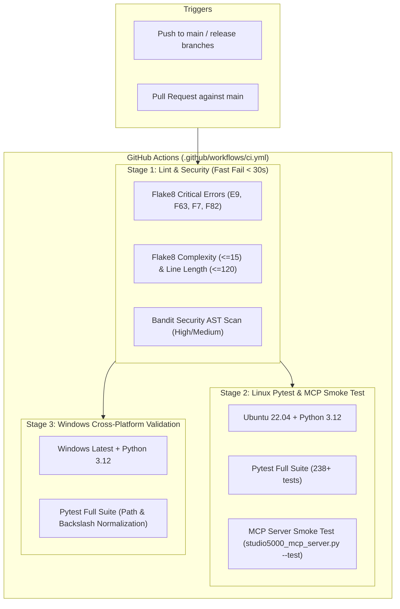

# Automated CI/CD & Build Infrastructure Implementation Plan

> **For agentic workers:** REQUIRED SUB-SKILL: Use superpowers:subagent-driven-development (recommended) or superpowers:executing-plans to implement this plan task-by-task. Steps use checkbox (`- [ ]`) syntax for tracking.

**Status:** Partial implementation. `.github/workflows/ci.yml` already provides a Python 3.12 pytest baseline; the remaining work is measured lint/security, smoke coverage, and any justified platform expansion.

**Goal:** Evolve the existing CI workflow into a reliable, measured pipeline with explicit Python 3.12 environment selection, critical lint/security gates, and cross-platform tests where fixtures and dependencies are available.

**Architecture:**


**Tech Stack:** GitHub Actions (YAML), Python 3.12, `flake8`, `bandit`, `pytest`, `pytest-cov`, Bash, PowerShell.

---

## Global Constraints

- Python 3.12 is the authoritative runtime target across all platforms.
- Record a baseline duration before setting a budget. A universal 2.5-minute target is not an acceptance criterion while torch/sentence-transformers/FAISS dependencies and multiple operating systems are in scope.
- Stage 1 (`lint-and-security`) must block Stages 2 and 3 if syntax or security vulnerabilities exist.
- No external Rockwell licenses, proprietary `.ACD`/`.L5X` binaries, or live PLC hardware may be required for CI to pass.
- Cross-platform tests must ensure path separators (`/` vs `\`), line endings (`\n` vs `\r\n`), and case sensitivity work seamlessly across Linux and Windows.
- Generated vendored Kaitai files (`src/acd/generated/`) should be excluded from complexity warnings to avoid noise.

## Review gates before implementation

- Validate the existing workflow with a YAML parser that treats `on` as a mapping key; do not rely on a YAML 1.1 parser that silently converts it to a boolean.
- Keep critical syntax/security failures blocking and style/complexity migration advisory until the repository has a measured baseline. Do not add a full-suite Windows job without confirming dependency and fixture availability.
- Proprietary `.ACD`/`.L5X` files are ignored; CI must use tracked synthetic fixtures and report optional real-fixture skips explicitly.

---

## File Map

### Create:
- `.flake8` — Flake8 linter configuration with max line length, complexity limits, and path exclusions.
- `.bandit.yaml` — Bandit security scanner configuration excluding vendored parsers and tests.
- `scripts/run_lint_security.sh` — Bash script for local lint and security scanning on Linux/macOS.
- `scripts/run_lint_security.bat` — Batch script for local lint and security scanning on Windows.
- `tests/ci/test_ci_configuration.py` — Unit tests verifying CI workflow YAML syntax and tool configs.

### Modify:
- `.github/workflows/ci.yml` — Multi-stage GitHub Actions CI workflow (lint-and-security, test-linux, test-windows).
- `README.md` — Add CI build status badge and contribution guidelines.
- `requirements.txt` — Ensure developer and test tools are clearly documented.

### Do Not Modify:
- `tests/test_direct_acd_deliverables.py` (preserve existing worktree changes).

---

## Task-by-Task Implementation Plan

### Task 1: Establish Code Quality & Linter Configurations

**Files:**
- Create: `.flake8`
- Create: `.bandit.yaml`

**Configuration Specs:**
```ini
# .flake8
[flake8]
max-line-length = 120
max-complexity = 15
select = E9,F63,F7,F82,E,W,F,C90
exclude =
    .git,
    __pycache__,
    .venv,
    venv,
    build,
    dist,
    src/acd/generated,
    *_vector_cache
ignore =
    E203,  # whitespace before ':' (black compatibility)
    W503   # line break before binary operator
```

```yaml
# .bandit.yaml
skips: ['B101']  # Allow assert statements in tests and internal checks
exclude_dirs:
  - 'tests'
  - 'src/acd/generated'
  - 'venv'
  - '.venv'
```

- [ ] **Step 1: Create `.flake8` file with standard project thresholds.**
  Set `max-line-length = 120`, `max-complexity = 15`, and exclude generated Kaitai parsers and cache directories.

- [ ] **Step 2: Create `.bandit.yaml` security profile.**
  Configure AST security checks across `src/` to catch insecure deserialization, dangerous subprocess calls, or hardcoded secrets.

- [ ] **Step 3: Run flake8 and bandit locally to verify configuration.**
  ```bash
  flake8 src tests --count --select=E9,F63,F7,F82 --show-source --statistics
  bandit -r src -c .bandit.yaml -ll -ii
  ```

---

### Task 2: Author Multi-Stage GitHub Actions Pipeline (`.github/workflows/ci.yml`)

**Files:**
- Modify: `.github/workflows/ci.yml`

- [ ] **Step 1: Implement Stage 1: `lint-and-security`.**
  - Runs on `ubuntu-latest` with Python 3.12.
  - Installs `flake8` and `bandit`.
  - Runs critical syntax and undefined name checks (`--select=E9,F63,F7,F82`).
  - Runs style/complexity checks.
  - Runs Bandit AST security scan.

- [ ] **Step 2: Implement Stage 2: `test-linux`.**
  - Depends on `lint-and-security` (`needs: lint-and-security`).
  - Runs on `ubuntu-latest` with Python 3.12 and `cache: 'pip'`.
  - Installs `requirements.txt` + `pytest pytest-cov`.
  - Executes full pytest suite: `python -m pytest -v --tb=short`.
  - Executes MCP server smoke test: `python src/mcp_server/studio5000_mcp_server.py --test`.

- [ ] **Step 3: Implement Stage 3: `test-windows`.**
  - Depends on `lint-and-security` (`needs: lint-and-security`).
  - Runs on `windows-latest` with Python 3.12 and `cache: 'pip'`.
  - Installs `requirements.txt` + `pytest`.
  - Executes full pytest suite: `python -m pytest -v --tb=short`.

- [ ] **Step 4: Verify workflow triggers.**
  Configure triggers for `push` to `main` and `pull_request` against `main`.

---

### Task 3: Implement Local Lint & Security Developer Scripts

**Files:**
- Create: `scripts/run_lint_security.sh`
- Create: `scripts/run_lint_security.bat`

- [ ] **Step 1: Write `scripts/run_lint_security.sh` for Linux/macOS.**
  Include colorized bash output, flake8 syntax checks, bandit scans, and pytest runner with exit status reporting.

  ```bash
  #!/usr/bin/env bash
  set -e
  echo "=== 1. Checking Python Syntax & Undefined Variables ==="
  flake8 src tests --count --select=E9,F63,F7,F82 --show-source --statistics

  echo "=== 2. Running Bandit Security Scan ==="
  bandit -r src -c .bandit.yaml -ll -ii

  echo "=== 3. Running Pytest Suite ==="
  python -m pytest -q

  echo "=== 4. Running MCP Smoke Test ==="
  python src/mcp_server/studio5000_mcp_server.py --test
  echo "All checks passed successfully!"
  ```

- [ ] **Step 2: Write `scripts/run_lint_security.bat` for Windows.**
  Provide matching PowerShell/Batch commands for Windows developers.

- [ ] **Step 3: Make bash script executable and test.**
  ```bash
  chmod +x scripts/run_lint_security.sh
  ./scripts/run_lint_security.sh
  ```

---

### Task 4: Add Automated CI Configuration & Workflow Syntax Tests

**Files:**
- Create: `tests/ci/test_ci_configuration.py`

- [ ] **Step 1: Write unit tests verifying CI files.**
  In `tests/ci/test_ci_configuration.py`:
  - Validate `.github/workflows/ci.yml` is valid YAML.
  - Verify all 3 jobs (`lint-and-security`, `test-linux`, `test-windows`) exist and specify `python-version: '3.12'`.
  - Verify `test-linux` and `test-windows` declare `needs: lint-and-security`.
  - Verify `.flake8` and `.bandit.yaml` files exist and contain required keys.
  - Verify `scripts/run_lint_security.sh` exists and is non-empty.

- [ ] **Step 2: Run CI configuration tests.**
  ```bash
  python -m pytest tests/ci/test_ci_configuration.py -v
  ```

---

### Task 5: Benchmark & Optimize CI Runtime (< 2.5 min)

**Files:**
- Modify: `.github/workflows/ci.yml`
- Modify: `README.md`

- [ ] **Step 1: Verify pip dependency caching.**
  Confirm `actions/setup-python@v5` uses `cache: 'pip'` to avoid redundant wheel compilation.

- [ ] **Step 2: Add CI build status badge to `README.md`.**
  Add badge at the top of `README.md`:
  `[](https://github.com/JLControls/studio5000-AI-Assistant/actions/workflows/ci.yml)`

- [ ] **Step 3: Run full local verification.**
  ```bash
  python -m pytest tests/ci/ -v
  python -m pytest -q
  ```

---

## Verification Commands

```bash
# 1. Run local lint and security script
./scripts/run_lint_security.sh

# 2. Run CI configuration unit tests
python -m pytest tests/ci/test_ci_configuration.py -v

# 3. Run full pytest suite
python -m pytest -q
```
