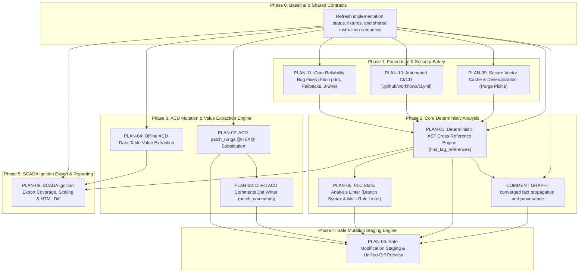

# Implementation Plans Index & Strategic Execution Roadmap

This directory contains actionable, step-by-step implementation plans for all **P0 (Critical)** and **P1 (High)** priority specifications defined in [docs/superpowers/specs/README.md](../specs/README.md).

Every implementation plan follows the strict **Superpowers TDD Plan Standard**:
- Self-contained goals, architecture, tech stack, and global constraints.
- Complete file maps (`Create`, `Modify`, `Do not modify`).
- Task-by-task breakdown with step-by-step checkbox (`- [ ]`) syntax.
- Failing unit/integration test specifications prior to code edits.
- Concrete Python 3.12 data models, binary structs, algorithms, and MCP JSON-RPC schemas.
- Verification commands (`python -m pytest ...`, `--test` smoke tests) and commit checkpoints.

## 0. Review status and source of truth

These documents are design backlog, not evidence that a feature is absent from
the tree. The implementation and tests are the source of truth. **Current
status, ordering and remaining deltas live in [../ROADMAP.md](../ROADMAP.md)**;
the table there supersedes the 2026-08-21 status column that used to be here.

Delivered plans have been moved to [../completed/](../completed/README.md)
(vendored ACD, v38 fidelity, iterative comment graph, human Ignition naming
engine). The interface-audit proposal is a spec, not a plan, and now lives at
[../specs/13-interface-audit-engine.md](../specs/13-interface-audit-engine.md).
SPEC-07, SPEC-12 and SPEC-13 have no implementation plan yet; the roadmap says
when one should be written.

---

## 1. High & Critical Priority Plans Overview

| Plan ID | Implementation Plan Document | Governing Spec | Primary Subsystem | Priority | Key Issues / Audit References |
| :--- | :--- | :--- | :--- | :---: | :--- |
| **PLAN-01** | [01-deterministic-ast-cross-reference.md](./01-deterministic-ast-cross-reference.md) | [SPEC-01](../specs/01-deterministic-ast-cross-reference.md) | `l5x_analyzer` | **P0 / Critical** | Issue #26, BUG-03 / Issue #12, §6, §13, Rank #1 |
| **PLAN-02** | [02-acd-patch-rungs-hex-substitution.md](./02-acd-patch-rungs-hex-substitution.md) | [SPEC-02](../specs/02-acd-patch-rungs-hex-substitution.md) | `acd` | **P0 / Critical** | BUG-01 / Issue #34, Issue #6, §6, §10, Rank #2 |
| **PLAN-03** | [03-direct-acd-comment-writer.md](./03-direct-acd-comment-writer.md) | [SPEC-03](../specs/03-direct-acd-comment-writer.md) | `acd` | **P1 / High** | Issue #22, Issue #6, §7, §10, Rank #12 |
| **PLAN-04** | [04-acd-datatable-value-extraction.md](./04-acd-datatable-value-extraction.md) | [SPEC-04](../specs/04-acd-datatable-value-extraction.md) | `acd` | **P1 / High** | BUG-02 / Issue #23, §6, §11, Rank #18 |
| **PLAN-05** | [05-plc-static-analysis-linter.md](./05-plc-static-analysis-linter.md) | [SPEC-05](../specs/05-plc-static-analysis-linter.md) | `verification` / `l5x_analyzer` | **P1 / High** | Issue #18, BUG-09, §8, §9, §12, Rank #4, #10, #14, #15, #16 |
| **PLAN-06** | [06-safe-modification-staging-diff.md](./06-safe-modification-staging-diff.md) | [SPEC-06](../specs/06-safe-modification-staging-diff.md) | `l5x_analyzer` / `mcp_server` | **P0 / Critical** | Section §3, §28, Rank #5, #11 |
| **PLAN-08** | [08-scada-ignition-export-coverage-and-scaling.md](./08-scada-ignition-export-coverage-and-scaling.md) | [SPEC-08](../specs/08-scada-ignition-export-coverage-and-scaling.md) | `ignition_exporter` | **P1 / High** | Issue #10, Issue #24, Issue #25, Issue #29, §15, Rank #8, #21, #22, #23 |
| **PLAN-09** | [09-security-safe-cache-and-deserialization.md](./09-security-safe-cache-and-deserialization.md) | [SPEC-09](../specs/09-security-safe-cache-and-deserialization.md) | `security` / `mcp_server` | **P1 / High** | BUG-05 / Issue #36, §20, Rank #4, #25 |
| **PLAN-10** | [10-ci-and-build-infrastructure.md](./10-ci-and-build-infrastructure.md) | [SPEC-10](../specs/10-ci-and-build-infrastructure.md) | `ci` | **P1 / High** | BUG-10 / Issue #35, §23, Rank #3 |
| **PLAN-11** | [11-core-bugfixes-and-mcp-reliability.md](./11-core-bugfixes-and-mcp-reliability.md) | [SPEC-11](../specs/11-core-bugfixes-and-mcp-reliability.md) | `code_generator` / `ai_assistant` / `l5x_analyzer` | **P1 / High** | BUG-04 (#37), BUG-06 (#38), BUG-07 (#39), BUG-08, BUG-09, Issue #5 |

---

## 2. Dependency Graph & Phase Sequencing

Implementation plans should be executed in dependency-ordered phases. The
baseline/contract gates are deliberately explicit because the current tree already
contains partial implementations:



### Phase Details:

1. **Phase 0 — Baseline & Contracts:** record what is already implemented, define shared operand roles/scope/provenance, and use tracked synthetic fixtures because proprietary `.ACD`/`.L5X` files are ignored.
2. **Phase 1 — CI, Security, & Core Stability (Plans 10, 09, 11):** establish measured CI gates, preserve safe cache formats, and verify stdio/project-scope/runtime behavior.
3. **Phase 2 — Deterministic Analysis (Plan 01, comment graph, Plan 05):** share one instruction-semantics table, retain unresolved entities as diagnostics, and avoid precision claims that the parser cannot prove.
4. **Phase 3 — ACD Byte Engine (Plans 02, 03, 04):** require golden binary fixtures, compression/pointer invariants, and explicit value/conversion provenance before mutating or exporting data.
5. **Phase 4 — Safe Staging (Plan 06):** route every L5X and ACD mutator through an atomic, digest-bound review/apply boundary; direct legacy writes are not considered safe completion.
6. **Phase 5 — SCADA Export (Plan 08 and the dated naming plan):** keep technical fields unchanged, define physical-channel denominators, and make report data/schema/output escaping stable.

---

## 3. Implementation Verification Strategy

After executing each plan task, run the repository verification matrix:

```text
# WSL/Linux: use the repository Python 3.12 environment explicitly.
venv/bin/python -m pytest tests/<subsystem>/ -q

# Windows equivalent:
# .\venv\Scripts\python.exe -m pytest tests\<subsystem> -q

# 2. Run the complete pytest regression suite
venv/bin/python -m pytest

# 3. Run the MCP server smoke test (verifies tool registration, doc index, sample queries)
venv/bin/python src/mcp_server/studio5000_mcp_server.py --test

# 4. Run lint and security scans
venv/bin/python -m flake8 src tests --count --select=E9,F63,F7,F82 --show-source
venv/bin/python -m bandit -r src -ll -ii
```

Optional real-project integration tests must report their skip reason when a
proprietary fixture is unavailable. A passing synthetic suite does not establish
Studio 5000 import validity or deployment safety.
