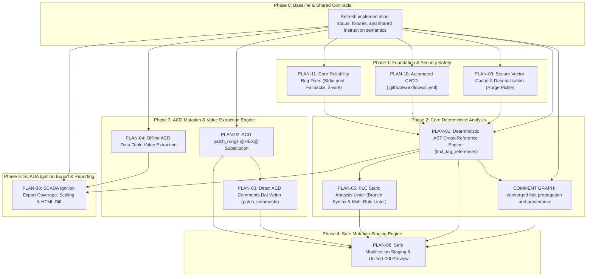

# Implementation Plans Index & Strategic Execution Roadmap

This directory contains actionable, step-by-step implementation plans for all **P0 (Critical)** and **P1 (High)** priority specifications defined in [docs/superpowers/specs/README.md](file:///home/hello/git/work/studio5000-AI-Assistant/docs/superpowers/specs/README.md).

Every implementation plan follows the strict **Superpowers TDD Plan Standard**:
- Self-contained goals, architecture, tech stack, and global constraints.
- Complete file maps (`Create`, `Modify`, `Do not modify`).
- Task-by-task breakdown with step-by-step checkbox (`- [ ]`) syntax.
- Failing unit/integration test specifications prior to code edits.
- Concrete Python 3.12 data models, binary structs, algorithms, and MCP JSON-RPC schemas.
- Verification commands (`python -m pytest ...`, `--test` smoke tests) and commit checkpoints.

## 0. Review status and source of truth

These documents are design backlog and review records, not evidence that every
listed feature is absent from the current tree. The implementation and tests are
the source of truth; each plan below must begin by measuring the current behavior
and then implement only the remaining delta.

| Plan | Current status (2026-08-21) |
| :--- | :--- |
| PLAN-01 | Partial: deterministic cross-reference and relationship delegation exist; sub-element/API/fixture coverage remains. |
| PLAN-02 | Partial: global tag mapping and token-aware substitution exist; strict validation and binary round-trip coverage remain. |
| PLAN-03 | Backlog: direct comment writing still needs a verified record/template and atomic integration. |
| PLAN-04 | Backlog: binary value decoding is not proven by tracked golden fixtures; snapshot provenance is required. |
| PLAN-05 | Backlog: linter rules need execution/scope semantics and conservative diagnostics. |
| PLAN-06 | Partial: L5X insertion still has direct-write paths; unified staging for every mutator is not complete. |
| PLAN-08 | Partial: raw analog retention exists; naming, I/O denominator, and report contracts remain. |
| PLAN-09 | Partial: current vector stores reject pickle; a central adapter-aware cache manager and safe cleanup remain. |
| PLAN-10 | Partial: a single Linux-oriented pytest workflow exists; measured gates and environment coverage remain. |
| PLAN-11 | Partial: project-overview and several reliability fixes exist; remaining protocol and semantic checks need verification. |

The dated vendor plan is archival/completed, the dated Ignition naming plan is
the canonical naming plan for Issue #29, and the iterative comment-graph plan is
implemented in `src/comment_graph/` with hardening work still tracked there.
SPEC-07 and SPEC-12 are P2 specifications without implementation plans by
design; do not infer missing plans from their presence in the specs index.

---

## 1. High & Critical Priority Plans Overview

| Plan ID | Implementation Plan Document | Governing Spec | Primary Subsystem | Priority | Key Issues / Audit References |
| :--- | :--- | :--- | :--- | :---: | :--- |
| **PLAN-01** | [01-deterministic-ast-cross-reference.md](file:///home/hello/git/work/studio5000-AI-Assistant/docs/superpowers/plans/01-deterministic-ast-cross-reference.md) | [SPEC-01](file:///home/hello/git/work/studio5000-AI-Assistant/docs/superpowers/specs/01-deterministic-ast-cross-reference.md) | `l5x_analyzer` | **P0 / Critical** | Issue #26, BUG-03 / Issue #12, §6, §13, Rank #1 |
| **PLAN-02** | [02-acd-patch-rungs-hex-substitution.md](file:///home/hello/git/work/studio5000-AI-Assistant/docs/superpowers/plans/02-acd-patch-rungs-hex-substitution.md) | [SPEC-02](file:///home/hello/git/work/studio5000-AI-Assistant/docs/superpowers/specs/02-acd-patch-rungs-hex-substitution.md) | `acd` | **P0 / Critical** | BUG-01 / Issue #34, Issue #6, §6, §10, Rank #2 |
| **PLAN-03** | [03-direct-acd-comment-writer.md](file:///home/hello/git/work/studio5000-AI-Assistant/docs/superpowers/plans/03-direct-acd-comment-writer.md) | [SPEC-03](file:///home/hello/git/work/studio5000-AI-Assistant/docs/superpowers/specs/03-direct-acd-comment-writer.md) | `acd` | **P1 / High** | Issue #22, Issue #6, §7, §10, Rank #12 |
| **PLAN-04** | [04-acd-datatable-value-extraction.md](file:///home/hello/git/work/studio5000-AI-Assistant/docs/superpowers/plans/04-acd-datatable-value-extraction.md) | [SPEC-04](file:///home/hello/git/work/studio5000-AI-Assistant/docs/superpowers/specs/04-acd-datatable-value-extraction.md) | `acd` | **P1 / High** | BUG-02 / Issue #23, §6, §11, Rank #18 |
| **PLAN-05** | [05-plc-static-analysis-linter.md](file:///home/hello/git/work/studio5000-AI-Assistant/docs/superpowers/plans/05-plc-static-analysis-linter.md) | [SPEC-05](file:///home/hello/git/work/studio5000-AI-Assistant/docs/superpowers/specs/05-plc-static-analysis-linter.md) | `verification` / `l5x_analyzer` | **P1 / High** | Issue #18, BUG-09, §8, §9, §12, Rank #4, #10, #14, #15, #16 |
| **PLAN-06** | [06-safe-modification-staging-diff.md](file:///home/hello/git/work/studio5000-AI-Assistant/docs/superpowers/plans/06-safe-modification-staging-diff.md) | [SPEC-06](file:///home/hello/git/work/studio5000-AI-Assistant/docs/superpowers/specs/06-safe-modification-staging-diff.md) | `l5x_analyzer` / `mcp_server` | **P0 / Critical** | Section §3, §28, Rank #5, #11 |
| **PLAN-08** | [08-scada-ignition-export-coverage-and-scaling.md](file:///home/hello/git/work/studio5000-AI-Assistant/docs/superpowers/plans/08-scada-ignition-export-coverage-and-scaling.md) | [SPEC-08](file:///home/hello/git/work/studio5000-AI-Assistant/docs/superpowers/specs/08-scada-ignition-export-coverage-and-scaling.md) | `ignition_exporter` | **P1 / High** | Issue #10, Issue #24, Issue #25, Issue #29, §15, Rank #8, #21, #22, #23 |
| **PLAN-09** | [09-security-safe-cache-and-deserialization.md](file:///home/hello/git/work/studio5000-AI-Assistant/docs/superpowers/plans/09-security-safe-cache-and-deserialization.md) | [SPEC-09](file:///home/hello/git/work/studio5000-AI-Assistant/docs/superpowers/specs/09-security-safe-cache-and-deserialization.md) | `security` / `mcp_server` | **P1 / High** | BUG-05 / Issue #36, §20, Rank #4, #25 |
| **PLAN-10** | [10-ci-and-build-infrastructure.md](file:///home/hello/git/work/studio5000-AI-Assistant/docs/superpowers/plans/10-ci-and-build-infrastructure.md) | [SPEC-10](file:///home/hello/git/work/studio5000-AI-Assistant/docs/superpowers/specs/10-ci-and-build-infrastructure.md) | `ci` | **P1 / High** | BUG-10 / Issue #35, §23, Rank #3 |
| **PLAN-11** | [11-core-bugfixes-and-mcp-reliability.md](file:///home/hello/git/work/studio5000-AI-Assistant/docs/superpowers/plans/11-core-bugfixes-and-mcp-reliability.md) | [SPEC-11](file:///home/hello/git/work/studio5000-AI-Assistant/docs/superpowers/specs/11-core-bugfixes-and-mcp-reliability.md) | `code_generator` / `ai_assistant` / `l5x_analyzer` | **P1 / High** | BUG-04 (#37), BUG-06 (#38), BUG-07 (#39), BUG-08, BUG-09, Issue #5 |

---

## 2. Dependency Graph & Phase Sequencing

Implementation plans should be executed in dependency-ordered phases. The
baseline/contract gates are deliberately explicit because the current tree already
contains partial implementations:



### Phase Details:

1. **Phase 0 — Baseline & Contracts:** record what is already implemented, define shared operand roles/scope/provenance, and use tracked synthetic fixtures because proprietary `.ACD`/`.L5X` files are ignored.
2. **Phase 1 — CI, Security, & Core Stability (Plans 10, 09, 11):** establish measured CI gates, preserve safe cache formats, and verify stdio/project-scope/runtime behavior.
3. **Phase 2 — Deterministic Analysis (Plan 01, comment graph, Plan 05):** share one instruction-semantics table, retain unresolved entities as diagnostics, and avoid precision claims that the parser cannot prove.
4. **Phase 3 — ACD Byte Engine (Plans 02, 03, 04):** require golden binary fixtures, compression/pointer invariants, and explicit value/conversion provenance before mutating or exporting data.
5. **Phase 4 — Safe Staging (Plan 06):** route every L5X and ACD mutator through an atomic, digest-bound review/apply boundary; direct legacy writes are not considered safe completion.
6. **Phase 5 — SCADA Export (Plan 08 and the dated naming plan):** keep technical fields unchanged, define physical-channel denominators, and make report data/schema/output escaping stable.

---

## 3. Implementation Verification Strategy

After executing each plan task, run the repository verification matrix:

```text
# WSL/Linux: use the repository Python 3.12 environment explicitly.
venv/bin/python -m pytest tests/<subsystem>/ -q

# Windows equivalent:
# .\venv\Scripts\python.exe -m pytest tests\<subsystem> -q

# 2. Run the complete pytest regression suite
venv/bin/python -m pytest

# 3. Run the MCP server smoke test (verifies tool registration, doc index, sample queries)
venv/bin/python src/mcp_server/studio5000_mcp_server.py --test

# 4. Run lint and security scans
venv/bin/python -m flake8 src tests --count --select=E9,F63,F7,F82 --show-source
venv/bin/python -m bandit -r src -ll -ii
```

Optional real-project integration tests must report their skip reason when a
proprietary fixture is unavailable. A passing synthetic suite does not establish
Studio 5000 import validity or deployment safety.
