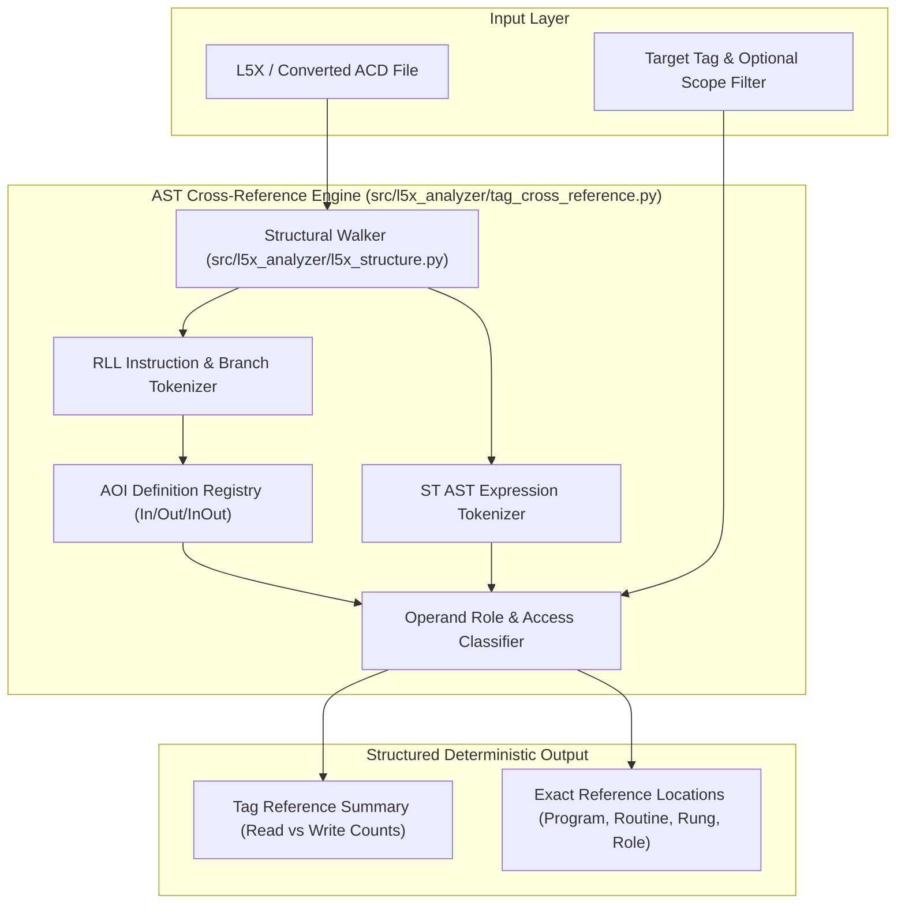

# SPEC-01: Deterministic AST Tag Cross-Reference Engine (`find_tag_references`)

**Status:** Backlog / Sprint 1 Target (Issue #26, BUG-03 / Issue #12)  
**Priority:** P0 / Critical  
**Subsystem:** `l5x_analyzer` (`src/l5x_analyzer/tag_cross_reference.py`)  
**Audit References:** [§6 BUG-03](file:///home/hello/git/work/studio5000-AI-Assistant/docs/ENGINEERING_AUDIT_2026.md#bug-03-p1-find_related_components-and-find_related_tags-return-false-empty-results), [§13 Cross-Reference Audit](file:///home/hello/git/work/studio5000-AI-Assistant/docs/ENGINEERING_AUDIT_2026.md#13-cross-reference--where-used-audit-issue-26), [§26 Ranked Feature #1](file:///home/hello/git/work/studio5000-AI-Assistant/docs/ENGINEERING_AUDIT_2026.md#26-ranked-feature-opportunities)

---

## 1. Problem Statement & Background

Industrial controls engineers rely on "Where-Used" / Cross-Reference queries as the most critical primitive when investigating PLC logic, assessing change impact, and troubleshooting faults. 

In current HEAD:
1. `find_related_components` in `src/l5x_analyzer/l5x_vector_db.py:419-445` constructs a synthetic natural language prompt (`f"uses {dependency}"`) and executes approximate cosine similarity queries against FAISS vector embeddings with a hardcoded threshold `0.2`.
2. Exact tag occurrences are missed completely, returning `{"success": true, "related_count": 0}` for critical tags referenced dozens of times across logic (e.g. `Htr1_Outlet_Temp` in the Kemco fixture).
3. `find_related_tags` in `src/tag_analyzer/tag_vector_db.py` relies on unindexed CSV dumps rather than querying the L5X/ACD project logic directly.

This creates a dangerous false sense of security where an engineer is led to believe a tag is unused or isolated when it is actively controlling high-power actuators or safety permissive chains.

---

## 2. Architectural Design & Principles

The cross-reference engine must be **100% deterministic**, built upon exact AST token parsing across all routines in the controller.



### Core Design Requirements:
- **No Vector Search / No Probabilities:** Tag lookup must match exact identifier tokens, handling array subscript indexing (`N101[18]`), UDT member navigation (`Htr1.Sts.Running`), and bit-level addressing (`StatusWord.0`).
- **Role Classification:** Every reference must be classified by its operational role:
  - `READ_SOURCE` (e.g., `XIC`, `XIO`, `MOV` source, `ADD` source, comparison operands)
  - `WRITE_DESTINATION` (e.g., `OTE`, `OTL`, `OTU`, `MOV` dest, `ADD` dest, math destinations)
  - `READ_WRITE_CONTROL` (e.g., `TON`, `TOF`, `RTO`, `CTU`, `PID`, `FAL` control structures)
  - `AOI_PARAMETER` (mapped against the specific AOI definition parameter `Usage="Input"|"Output"|"InOut"`)
- **Scope Awareness:** Differentiate Controller-scoped tags from Program-scoped tags (`Program:ProgName.TagName`).
- **Performance:** Ingest and index an enterprise L5X project in < 250ms; sub-millisecond query response time.

---

## 3. Data Models & Interface Specification

### 3.1 Enumerations and Typed Classes

```python
from enum import Enum
from dataclasses import dataclass
from typing import List, Optional, Dict, Any

class OperandRole(str, Enum):
    READ_SOURCE = "READ_SOURCE"
    WRITE_DESTINATION = "WRITE_DESTINATION"
    READ_WRITE_CONTROL = "READ_WRITE_CONTROL"
    AOI_INPUT = "AOI_INPUT"
    AOI_OUTPUT = "AOI_OUTPUT"
    AOI_INOUT = "AOI_INOUT"
    UNKNOWN = "UNKNOWN"

@dataclass(frozen=True)
class TagReference:
    tag_name: str
    base_tag: str
    sub_element: Optional[str]  # e.g., "PRE", "ACC", "0", "Sts.Running"
    scope_type: str            # "Controller" or "Program"
    program: Optional[str]     # None if Controller-scoped routine
    routine: str
    routine_type: str          # "RLL" or "ST"
    rung_number: Optional[int] # None for ST
    line_number: Optional[int] # None for RLL
    instruction_opcode: str    # e.g., "XIC", "OTE", "SCP", "AOI_MotorControl"
    operand_index: int         # 0-based operand parameter index
    role: OperandRole
    raw_logic_snippet: str     # CDATA rung text or ST statement snippet

@dataclass
class TagReferenceReport:
    tag_name: str
    base_tag: str
    total_references: int
    read_count: int
    write_count: int
    control_count: int
    is_destructive: bool       # True if write_count > 0
    references: List[TagReference]
    programs_involved: List[str]
    routines_involved: List[str]
```

### 3.2 MCP Tool Registration

Add a new authoritative tool `find_tag_references` and update legacy wrappers `find_related_components` and `find_related_tags` to delegate directly to this deterministic engine.

```json
{
  "name": "find_tag_references",
  "description": "Deterministically finds all where-used logic references for a given tag across all routines in an L5X or ACD project, classifying each as read, write, control, or AOI parameter.",
  "parameters": {
    "type": "object",
    "properties": {
      "file_path": {
        "type": "string",
        "description": "Path to the .L5X or .ACD project file."
      },
      "tag_name": {
        "type": "string",
        "description": "The exact tag name to search (e.g. 'Htr1_Outlet_Temp' or base tag 'Htr1')."
      },
      "program_scope": {
        "type": "string",
        "description": "Optional program name to filter program-scoped tags or specific routines."
      },
      "match_sub_elements": {
        "type": "boolean",
        "description": "If true, searching for base tag 'Htr1' returns references to 'Htr1.Cmd', 'Htr1.Out', etc. Default is true."
      }
    },
    "required": ["file_path", "tag_name"]
  }
}
```

---

## 4. Implementation Details

### 4.1 Instruction Role Mapping Rules

Define static lookup tables for all standard Rockwell Studio 5000 instructions:

```python
# Mapping: Opcode -> List[OperandRole]
INSTRUCTION_OPERAND_ROLES = {
    # Bit instructions
    "XIC": [OperandRole.READ_SOURCE],
    "XIO": [OperandRole.READ_SOURCE],
    "ONS": [OperandRole.READ_WRITE_CONTROL],
    "OTE": [OperandRole.WRITE_DESTINATION],
    "OTL": [OperandRole.WRITE_DESTINATION],
    "OTU": [OperandRole.WRITE_DESTINATION],
    
    # Timers / Counters
    "TON": [OperandRole.READ_WRITE_CONTROL, OperandRole.READ_SOURCE, OperandRole.READ_SOURCE],
    "TOF": [OperandRole.READ_WRITE_CONTROL, OperandRole.READ_SOURCE, OperandRole.READ_SOURCE],
    "RTO": [OperandRole.READ_WRITE_CONTROL, OperandRole.READ_SOURCE, OperandRole.READ_SOURCE],
    "CTU": [OperandRole.READ_WRITE_CONTROL, OperandRole.READ_SOURCE, OperandRole.READ_SOURCE],
    "CTD": [OperandRole.READ_WRITE_CONTROL, OperandRole.READ_SOURCE, OperandRole.READ_SOURCE],
    "RES": [OperandRole.WRITE_DESTINATION],
    
    # Move / Math
    "MOV": [OperandRole.READ_SOURCE, OperandRole.WRITE_DESTINATION],
    "MVM": [OperandRole.READ_SOURCE, OperandRole.READ_SOURCE, OperandRole.WRITE_DESTINATION],
    "ADD": [OperandRole.READ_SOURCE, OperandRole.READ_SOURCE, OperandRole.WRITE_DESTINATION],
    "SUB": [OperandRole.READ_SOURCE, OperandRole.READ_SOURCE, OperandRole.WRITE_DESTINATION],
    "MUL": [OperandRole.READ_SOURCE, OperandRole.READ_SOURCE, OperandRole.WRITE_DESTINATION],
    "DIV": [OperandRole.READ_SOURCE, OperandRole.READ_SOURCE, OperandRole.WRITE_DESTINATION],
    "CLR": [OperandRole.WRITE_DESTINATION],
    
    # Comparisons
    "EQU": [OperandRole.READ_SOURCE, OperandRole.READ_SOURCE],
    "NEQ": [OperandRole.READ_SOURCE, OperandRole.READ_SOURCE],
    "GRT": [OperandRole.READ_SOURCE, OperandRole.READ_SOURCE],
    "LES": [OperandRole.READ_SOURCE, OperandRole.READ_SOURCE],
    "GEQ": [OperandRole.READ_SOURCE, OperandRole.READ_SOURCE],
    "LEQ": [OperandRole.READ_SOURCE, OperandRole.READ_SOURCE],
    "LIM": [OperandRole.READ_SOURCE, OperandRole.READ_SOURCE, OperandRole.READ_SOURCE],
    
    # Flow & Program
    "JSR": [OperandRole.READ_SOURCE], # Routine Name + Inputs (READ_SOURCE) + Outputs (WRITE_DESTINATION)
    
    # Advanced Process / Scaling
    "SCP": [OperandRole.READ_SOURCE, OperandRole.READ_SOURCE, OperandRole.READ_SOURCE, OperandRole.READ_SOURCE, OperandRole.READ_SOURCE, OperandRole.WRITE_DESTINATION],
    "SCL": [OperandRole.READ_SOURCE, OperandRole.READ_SOURCE, OperandRole.READ_SOURCE, OperandRole.READ_SOURCE, OperandRole.READ_SOURCE, OperandRole.WRITE_DESTINATION],
}
```

### 4.2 AOI Parameter Mapping

For custom Add-On Instructions (`AOI_*`):
1. Extract the AOI signature from the `<AddOnInstructionDefinitions>` element via `src/l5x_analyzer/l5x_fact_accessor.py`.
2. Inspect each parameter's `Usage` attribute:
   - `Usage="Input"` $\rightarrow$ `OperandRole.AOI_INPUT`
   - `Usage="Output"` $\rightarrow$ `OperandRole.AOI_OUTPUT`
   - `Usage="InOut"` $\rightarrow$ `OperandRole.AOI_INOUT`

### 4.3 RLL Tokenizer Strategy

Given an RLL rung CDATA string:
`[XIC(Htr1_Disch_P1_Aux) , XIC(Htr1_Run_Out) ] XIO(Htr1_Estop) OTE(Htr1_Run_Out);`
1. Split instructions by matching `([A-Za-z0-9_]+)\(([^)]*)\)`.
2. For each instruction, extract the opcode and comma-separated arguments.
3. Split arguments by comma while respecting nested brackets or parenthetical expressions.
4. Normalize tag name, strip whitespace, extract base tag:
   - `Htr1.Sts.Running` $\rightarrow$ Base: `Htr1`, Sub: `Sts.Running`
   - `Alarms[4].2` $\rightarrow$ Base: `Alarms`, Sub: `[4].2`

---

## 5. Testing & Acceptance Criteria

### 5.1 Unit Tests (`tests/l5x_analyzer/test_tag_cross_reference.py`)
- Test standard bit instructions (`XIC`, `OTE`, `OTL`, `OTU`).
- Test math and move instructions (`MOV`, `ADD`, `SCP`).
- Test AOI parameter resolution using a defined AOI with Input, Output, and InOut parameters.
- Test structured text routine tokenization (`IF TagA THEN TagB := TagC + 1; END_IF;`).
- Test array and UDT sub-element matching.

### 5.2 Integration Tests
- Query `Htr1_Outlet_Temp` on `tests/acd/KemcoWaterHeater/Kemco_HA105.ACD` (converted) and verify exact reference count matching Studio 5000 native where-used (11 references across Scaling and Control routines).
- Verify `find_related_components` and `find_related_tags` return exact deterministic results without false-empty responses.

### 5.3 Acceptance Criteria
- Zero vector queries are executed for tag where-used cross-references.
- Output includes program name, routine name, rung number, instruction opcode, and classified role.
- All unit tests pass in `< 1.0s`.
