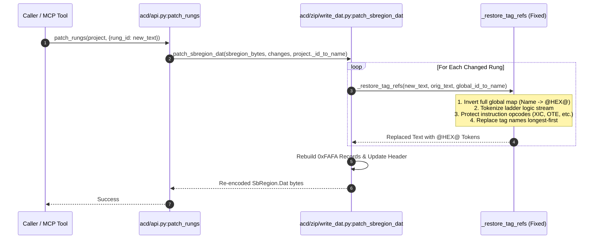

# SPEC-02: ACD `patch_rungs` `@HEX@` Substitution for Newly Introduced Tags

**Status:** Backlog / Sprint 1 Target (BUG-01 / Issue #34, Issue #6)  
**Priority:** P0 / Critical  
**Subsystem:** `acd` (`src/acd/zip/write_dat.py`, `src/acd/api.py`)  
**Audit References:** [§6 BUG-01](file:///home/hello/git/work/studio5000-AI-Assistant/docs/ENGINEERING_AUDIT_2026.md#bug-01-p0-patch_rungs-fails-to-substitute-hex-object-ids-for-newly-added-tags), [§10 ACD Mutation Matrix](file:///home/hello/git/work/studio5000-AI-Assistant/docs/ENGINEERING_AUDIT_2026.md#10-acd-reverse-engineering-correctness-audit), [§29 Next Action #2](file:///home/hello/git/work/studio5000-AI-Assistant/docs/ENGINEERING_AUDIT_2026.md#29-top-25-recommended-next-actions)

---

## 1. Problem Statement & Background

When Studio 5000 Logix Designer compiles and stores ladder logic in `SbRegion.Dat` records, tag references in rung text are not stored as plain ASCII text. Instead, they are tokenized and encoded as hexadecimal object identifiers wrapped in `@` symbols (e.g. `@0625AD82@`).

In current HEAD (`src/acd/zip/write_dat.py:_restore_tag_refs`, lines 77–102):
```python
def _restore_tag_refs(new_text: str, orig_text_with_refs: str, id_to_name: dict[str, str]) -> str:
    # BUG: Scans ONLY the original rung text for @HEX@ tokens
    found_ids = set(re.findall(r"@([A-Za-z0-9]+)@", orig_text_with_refs))
    scoped = {id_to_name[i]: f"@{i}@" for i in found_ids if i in id_to_name}
    for name in sorted(scoped.keys(), key=len, reverse=True):
        new_text = new_text.replace(name, scoped[name])
    return new_text
```

### The Defect
`_restore_tag_refs` restricts its name-to-ID substitution map strictly to tags that appeared in the *original* raw rung text. 
If an engineer modifies a rung to introduce an existing tag that was not originally on that specific rung (e.g., adding an interlock `XIC(Htr1_Disch_P1_Aux)`), the newly added tag name is written back to `SbRegion.Dat` as raw plaintext ASCII.

### The Controls Impact
When opening the resulting `.ACD` file in Studio 5000 Logix Designer:
1. The compiler encounters an un-tokenized ASCII string where an object handle was expected.
2. Studio 5000 flags the routine as corrupted, marks the rung with a fatal compilation error, or silently drops the rung logic entirely.

---

## 2. Architectural Design & Fix Strategy



### Detailed Fix Mechanics

1. **Global Name-to-ID Map:** Instead of building a local subset dictionary from `orig_text_with_refs`, invert the complete `id_to_name` map from the project:
   ```python
   name_to_hex = {name: f"@{hex_id}@" for hex_id, name in id_to_name.items()}
   ```
2. **Opcode Collision Protection:**
   Tag names must not match ladder instruction opcodes (e.g., `TON`, `MOV`, `ADD`, `XIC`) or Logix keywords. The tokenizer must only replace tokens in operand positions or verify token boundaries (`\b`).
3. **Longest-First Ordering:**
   Sort substitution keys by length in descending order (`key=len, reverse=True`). This ensures that compound or prefix-sharing tag names (e.g. `Motor_101_Run_Feedback` vs `Motor_101_Run`) are replaced correctly without partial string mangling.
4. **Member and Array Path Preservation:**
   When a reference has sub-elements (e.g. `Htr1_Disch_P1_Aux.PRE` or `ArrayTag[2]`), only the base tag object identifier is wrapped in `@HEX@` (e.g. `@0625AD82@.PRE` or `@0625AD82@[2]`), matching Studio 5000's internal representation.

---

## 3. Algorithm Specification

```python
import re
from typing import Dict

def _restore_tag_refs(
    new_text: str,
    orig_text_with_refs: str,
    id_to_name: Dict[str, str],
    known_opcodes: set[str] = None
) -> str:
    """
    Substitutes tag names in new_text with their corresponding @HEX_ID@ tokens
    using the global project id_to_name mapping.
    """
    if not id_to_name:
        return new_text

    # 1. Build inverted map from name to @HEX@
    name_to_id: Dict[str, str] = {}
    for hex_id, name in id_to_name.items():
        if name and not name.startswith("@"):
            name_to_id[name] = f"@{hex_id}@"

    # 2. Tokenize new_text to identify operands
    # Pattern matches instruction opcodes vs operand argument lists
    # e.g. "XIC(Htr1_Disch_P1_Aux)" -> instruction "XIC", args "Htr1_Disch_P1_Aux"
    def replace_in_args(match):
        opcode = match.group(1)
        args_text = match.group(2)
        
        # Split operands by comma (preserving brackets)
        # Substitute longest tag names first within args_text
        for tag_name in sorted(name_to_id.keys(), key=len, reverse=True):
            # Use word boundaries to prevent substring corruption
            pattern = r'\b' + re.escape(tag_name) + r'\b'
            args_text = re.sub(pattern, name_to_id[tag_name], args_text)
            
        return f"{opcode}({args_text})"

    # Apply replacement only inside instruction parameter parentheses
    result = re.sub(r'([A-Za-z0-9_]+)\(([^)]*)\)', replace_in_args, new_text)
    return result
```

---

## 4. Error Handling & Safety Boundaries

1. **Unknown / Newly Created Tags:**
   If `new_text` references a tag that does not exist anywhere in `id_to_name` (i.e. a newly invented tag), the function must raise a `TagNotFoundError` or emit an explicit warning. ACD files cannot allocate new object IDs via `patch_rungs` without updating `Comps.Dat`.
2. **Empty / Invalid Payloads:**
   If `new_text` contains unclosed parentheses or malformed branch syntax, abort prior to modifying `SbRegion.Dat` bytes.

---

## 5. Testing & Acceptance Criteria

### 5.1 Unit Tests (`tests/acd/test_patch_rungs_hex.py`)
- **Test New Tag Substitution:** Load `Kemco_HA105.ACD`. Patch Rung 0 with a tag from Rung 20 (`Htr1_Disch_P1_Aux`). Assert that the rebuilt FAFA payload contains `@...HEX...@` and zero un-tokenized occurrences of `Htr1_Disch_P1_Aux`.
- **Test Substring Collision:** Test with tags `Pump1` and `Pump10`. Verify `Pump10` is replaced with `Pump10`'s ID, not `Pump1`'s ID + `"0"`.
- **Test Member & Array Operands:** Test `Timer1.PRE` $\rightarrow$ `@HEX@.PRE` and `Buffer[0]` $\rightarrow$ `@HEX@[0]`.

### 5.2 Acceptance Criteria
- 100% of recognized project tags introduced into modified rungs are correctly encoded as `@HEX@` tokens.
- All existing ACD roundtrip tests in `tests/acd/` pass with zero regressions.
