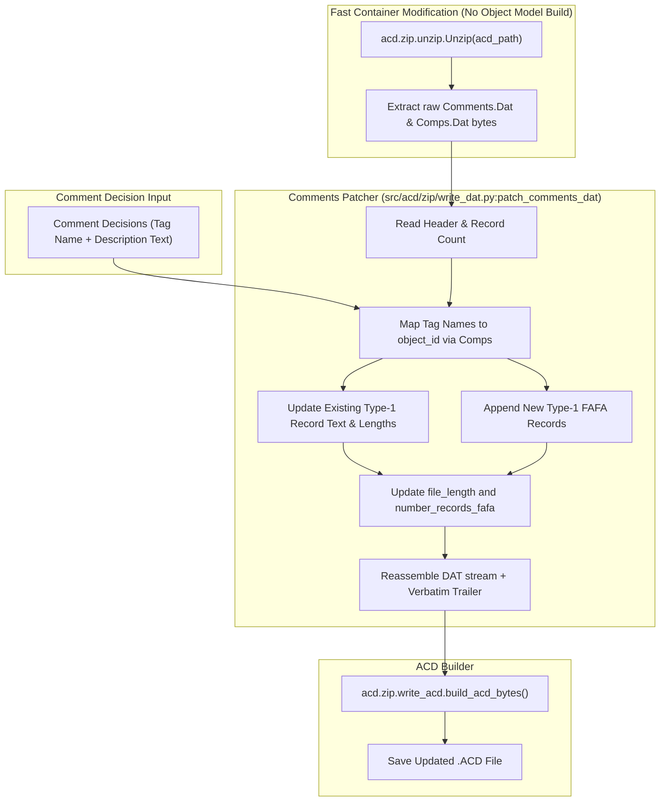

# SPEC-03: Direct ACD Comment Writer (`patch_comments`)

**Status:** Backlog Target (Feature #2, Issue #22, Issue #6)  
**Priority:** P1 / High  
**Subsystem:** `acd` (`src/acd/zip/write_dat.py`, `src/acd/record/comments.py`, `src/acd/api.py`)  
**Audit References:** [§6 BUG-01](file:///home/hello/git/work/studio5000-AI-Assistant/docs/ENGINEERING_AUDIT_2026.md#bug-01-p0-patch_rungs-fails-to-substitute-hex-object-ids-for-newly-added-tags), [§7 Silent Data Loss #1](file:///home/hello/git/work/studio5000-AI-Assistant/docs/ENGINEERING_AUDIT_2026.md#7-false-success--silent-data-loss-findings), [§10 ACD Mutation Matrix](file:///home/hello/git/work/studio5000-AI-Assistant/docs/ENGINEERING_AUDIT_2026.md#10-acd-reverse-engineering-correctness-audit), [§26 Ranked Feature #2](file:///home/hello/git/work/studio5000-AI-Assistant/docs/ENGINEERING_AUDIT_2026.md#26-ranked-feature-opportunities)

---

## 1. Problem Statement & Background

Currently, when `generate_comment_deliverables` or `analyze_comment_graph` is called with `edit_acd=True`, the pipeline claims `success: true` and generates an `_updated.ACD` artifact.

However:
1. `src/acd/record/comments.py` only contains parsing logic (`CommentsRecord.parse`).
2. There is no writer for `Comments.Dat`.
3. Running `generate_deliverables(edit_acd=True)` with comment-only decisions generates an ACD file where **zero** comments have actually been written into `Comments.Dat`.

To date, engineers have been forced to rely exclusively on generating `Comment_Delta.CSV` and manually importing it inside Studio 5000. Writing directly to `Comments.Dat` enables fully automated, offline ACD comment enrichment.

---

## 2. ACD `Comments.Dat` Binary Format Analysis

`Comments.Dat` uses the identical DAT container structure as `SbRegion.Dat`.

### 2.1 Container Header (Offset 0–24 bytes)
| Offset | Field | Type | Description |
| :--- | :--- | :--- | :--- |
| `0x00` | `format_type` | `u32` | Format identifier |
| `0x04` | `blank_2` | `u32` | Reserved |
| `0x08` | `file_length` | `u32` | **Bounds the records region** (`first_record_position` to `file_length+1`) |
| `0x0C` | `first_record_position` | `u32` | Offset where records begin (typically `8192` / `0x2000`) |
| `0x10` | `blank_3` | `u32` | Reserved |
| `0x14` | `number_records_fafa` | `u32` | **Count of `0xFAFA` records**; must be incremented on record addition |
| `0x18` | `header_buffer` | bytes | Verbatim copy up to `first_record_position` |

### 2.2 Record Framing & Types
Records are framed as: `[identifier: u16][len_record: u32][payload: len_record - 6]`.
`identifier = 0xFAFA` (64250) represents comment records.

Inside the `0xFAFA` payload:
- Header (10 bytes): `seq_number (u16)`, `record_type (u16)`, `sub_record_length (u16)`, `parent (u32)`
- Record Types:
  - **Type 1 (`AsciiRecord`): Tag/Component Level Descriptions.**
    - Body structure: `unknown_1[13]`, `object_id (u32)`, `unknown_2[13]`, `record_string (UTF-8, null-terminated)`.
    - Binds strictly to `object_id` from `Comps.Dat`.
  - **Type 11 (`OperandRecord`): Operand / Member Level Descriptions.**
    - Body carries an internal operand handle like `.!0625AD82`.

---

## 3. Architecture & Implementation Plan



### 3.1 Function Signature (`src/acd/zip/write_dat.py`)

```python
def patch_comments_dat(
    comments_bytes: bytes,
    tag_descriptions: dict[int, str], # object_id -> new description text
    template_record_bytes: Optional[bytes] = None
) -> bytes:
    """
    Patches Comments.Dat by updating existing Type-1 FAFA records or appending new ones.
    Recomputes file_length and number_records_fafa in the header while preserving trailer.
    """
```

### 3.2 High-Level API (`src/acd/api.py`)

```python
def patch_comments(project: ACDProject, comment_map: dict[str, str]) -> None:
    """
    Updates or adds tag descriptions directly to the project's Comments.Dat stream.
    comment_map: Mapping of tag_name -> description_text.
    """
```

---

## 4. Pipeline Integration & Safety Gates

1. **Pipeline Integration (`src/tag_analyzer/comment_pipeline.py`):**
   When `generate_deliverables(edit_acd=True)` is called:
   - Identify tag-level description decisions.
   - Resolve tag names to `object_id` from project metadata.
   - Call `patch_comments`.
   - Call `patch_rungs` if rung logic modifications are also present.
   - Set `success: true` only if both logic and descriptions were successfully committed.
2. **Offline Fallback Guarantee:**
   Because Type 11 operand handle generation requires complex object graph linking, Phase 1 implements 100% of Type 1 (Tag-level descriptions). Type 11 operand comments continue to be exported via `Comment_Delta.CSV` until verified against native Studio 5000 v38 compilers.

---

## 5. Testing & Acceptance Criteria

### 5.1 Unit Tests (`tests/acd/test_comments_writer.py`)
- **Round-Trip Fidelity:** Prove `Unzip` $\rightarrow$ `build_acd_bytes` without modifications produces byte-identical output.
- **Modify Existing Description:** Overwrite an existing tag description in `Kemco_HA105.ACD`. Re-parse with `CommentsRecord.parse` and assert new description text matches.
- **Append New Description:** Add a description to an uncommented tag. Assert that `number_records_fafa` increments by 1 and re-parsing displays the new description.
- **L5X Conversion Fidelity:** Convert the patched ACD to L5X (`convert_acd_to_l5x`) and verify that `<Description CDATA>` contains the newly patched comment.

### 5.2 Acceptance Criteria
- `generate_deliverables(edit_acd=True)` writes tag descriptions to `Comments.Dat`.
- The modified `.ACD` file opens without corruption in Studio 5000 v38.
