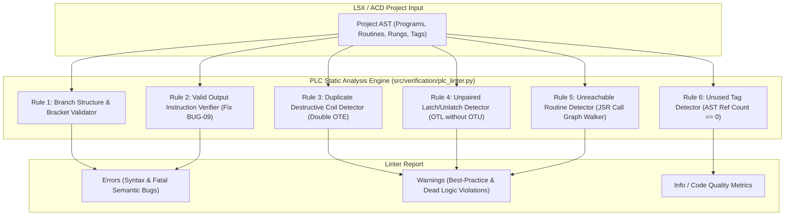

# SPEC-05: PLC Static Analysis Linter & AST Syntax Verification

**Status:** Backlog Target (Feature #4, Issue #18, BUG-09, Rank #4, #10, #14, #15, #16)  
**Priority:** P1 / High  
**Subsystem:** `verification` (`src/verification/plc_linter.py`, `src/verification/sdk_verifier.py`)
**Audit References:** [§6 BUG-09](file:///home/hello/git/work/studio5000-AI-Assistant/docs/ENGINEERING_AUDIT_2026.md#bug-09-p2-syntax-verifier-flags-standard-timercountermathaoi-output-rungs-as-input_only-errors-if-they-lack-oteotlotu), [§8 Controls Correctness](file:///home/hello/git/work/studio5000-AI-Assistant/docs/ENGINEERING_AUDIT_2026.md#8-industrial-controls--plc-semantic-correctness-findings), [§9 Ladder Parser Gap](file:///home/hello/git/work/studio5000-AI-Assistant/docs/ENGINEERING_AUDIT_2026.md#9-ladder--rll-parser-and-generator-audit), [§12 Static Analysis Matrix](file:///home/hello/git/work/studio5000-AI-Assistant/docs/ENGINEERING_AUDIT_2026.md#12-static-analysis--review-opportunity-assessment)

---

## 1. Problem Statement & Background

Static analysis is an essential capability for preventing PLC runtime failures before commissioning physical machinery. The current syntax verifier (`src/verification/sdk_verifier.py`) exhibits several critical deficiencies:

1. **False `INPUT_ONLY` Warnings (BUG-09):** The verifier flags valid rungs containing timers, counters, math, or AOIs (e.g. `XIC(Run) TON(Timer1, 5000, 0);`) as errors because it checks only for `OTE`, `OTL`, or `OTU`.
2. **Missing Branch Syntax Validation:** Bracket balance `[` vs `]` and branch separators `,` are completely ignored, permitting malformed branch rungs like `[XIC(A) XIC(B) , OTE(C)` to pass verification.
3. **No Semantic PLC Linting:** Common industrial logic defects—such as duplicate destructive coils (`OTE` to the same bit in multiple rungs), unlatched `OTL` bits missing an `OTU`, unreachable dead routines uncalled by `JSR`, and unused tags—are not detected.

---

## 2. Architectural Design & Linting Rules



---

## 3. Detailed Linting Rule Specifications

### Rule 1: Branch Structure & Bracket Validation
- **Severity:** `ERROR`
- **Scope:** RLL Rungs
- **Logic:**
  - Verify every `[` has a matching `]`.
  - Verify branch separators `,` only occur within valid `[...]` blocks.
  - Verify empty branches `[,]` or trailing separators `[XIC(A),]` are rejected.

### Rule 2: Valid Output Instruction Verification (Fix BUG-09)
- **Severity:** `ERROR`
- **Scope:** RLL Rungs
- **Logic:**
  - A rung must terminate in at least one valid output instruction branch.
  - Valid output instructions include:
    - Bit outputs: `OTE`, `OTL`, `OTU`, `ONS`, `OSF`, `OSR`
    - Timers / Counters: `TON`, `TOF`, `RTO`, `CTU`, `CTD`, `RES`
    - Math / Move: `MOV`, `MVM`, `COP`, `CPS`, `CPT`, `ADD`, `SUB`, `MUL`, `DIV`, `MOD`, `CLR`
    - Program flow: `JSR`, `RET`, `SBR`, `TND`
    - Custom AOI definitions where at least one output/inout parameter is bound.

### Rule 3: Duplicate Destructive Coil (`OTE`) Check
- **Severity:** `WARNING`
- **Scope:** Controller / Program
- **Controls Rationale:** Writing multiple `OTE` coils to the same boolean bit across different rungs causes the first rung's execution to be overwritten by the second on every scan cycle, causing baffling machine behavior.
- **Logic:** Scan all write references via [SPEC-01](file:///home/hello/git/work/studio5000-AI-Assistant/docs/specs/01-deterministic-ast-cross-reference.md). Flag any `BOOL` tag written by more than one `OTE` instruction within the same scan cycle.

### Rule 4: Unpaired `OTL` / `OTU` Check
- **Severity:** `WARNING`
- **Scope:** Controller / Program
- **Logic:** If a tag is written with `OTL` (Latch), verify that at least one `OTU` (Unlatch) instruction exists in the project referencing the same tag, and vice versa.

### Rule 5: Unreachable Routine Detection
- **Severity:** `WARNING`
- **Scope:** Program
- **Logic:**
  - Build a directed routine call graph starting from each Program's `MainRoutineName`.
  - Trace all `JSR` instructions recursively.
  - Flag any routine defined in the program that has in-degree 0 in the JSR call tree (unless designated as `FaultRoutineName`).

### Rule 6: Unused Tag Detection
- **Severity:** `INFO`
- **Scope:** Controller / Program
- **Logic:** Cross-reference all tag definitions against the AST cross-reference engine ([SPEC-01](file:///home/hello/git/work/studio5000-AI-Assistant/docs/specs/01-deterministic-ast-cross-reference.md)). Flag tags with total reference count equal to 0 (excluding I/O module mapped tags and produce/consume tags).

---

## 4. MCP Interface Specification

```json
{
  "name": "lint_plc_logic",
  "description": "Performs comprehensive static analysis linting on an L5X or ACD project, detecting branch syntax errors, duplicate destructive OTE coils, unlatched OTLs, uncalled dead routines, and unused tags.",
  "parameters": {
    "type": "object",
    "properties": {
      "file_path": {
        "type": "string",
        "description": "Path to the .L5X or .ACD project file."
      },
      "rules": {
        "type": "array",
        "items": {"type": "string"},
        "description": "Optional list of specific rule names to run. Runs all rules by default."
      }
    },
    "required": ["file_path"]
  }
}
```

---

## 5. Testing & Acceptance Criteria

### 5.1 Unit Tests (`tests/verification/test_plc_linter.py`)
- Test branch bracket matcher on malformed strings: `[XIC(A) XIC(B)` (fails), `[XIC(A) , XIC(B)] OTE(C);` (passes).
- Test timer and math rungs: `XIC(In) TON(Timer1, 1000, 0);` passes with 0 warnings.
- Test duplicate `OTE` detection on synthetic program with two rungs driving `Motor_Run`.
- Test unreachable routine detector with an uncalled sub-routine.

### 5.2 Acceptance Criteria
- `validate_ladder_logic` and `lint_plc_logic` report zero false-positive `INPUT_ONLY` warnings on standard Logix timer, counter, math, and AOI rungs.
- Duplicate `OTE` coils and orphaned routines are detected with 100% precision.
