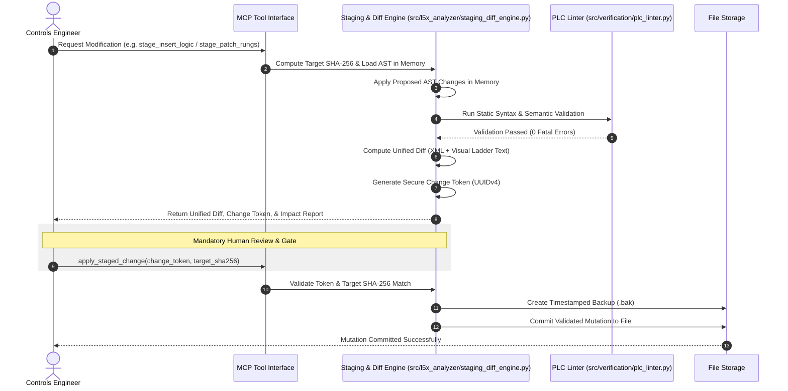

# SPEC-06: Safe Modification Staging & Unified-Diff Preview Engine

**Status:** Backlog Target (Feature #5, Audit §3 & §28, Rank #5, #11)  
**Priority:** P0 / Critical  
**Subsystem:** `l5x_analyzer` / `mcp_server` (`src/l5x_analyzer/staging_diff_engine.py`)  
**Audit References:** [§3 Trust / Safety Model](file:///home/hello/git/work/studio5000-AI-Assistant/docs/ENGINEERING_AUDIT_2026.md#3-trust--safety-model), [§28 Safe Modification Workflow](file:///home/hello/git/work/studio5000-AI-Assistant/docs/ENGINEERING_AUDIT_2026.md#28-special-investigation-safe-modification-workflow), [§26 Ranked Feature #5](file:///home/hello/git/work/studio5000-AI-Assistant/docs/ENGINEERING_AUDIT_2026.md#26-ranked-feature-opportunities)

---

## 1. Problem Statement & Background

Industrial automation projects directly control physical equipment, high-pressure boilers, robotic cells, and high-voltage distribution. 

In current HEAD:
1. `smart_insert_logic` and `patch_rungs` directly mutate target files on disk without presenting a diff to the engineer first.
2. No dry-run verification is enforced before writing bytes.
3. No automatic timestamped `.bak` backup copies are generated prior to mutation.

If an AI assistant hallucinates an invalid rung, deletes a safety permissive interlock, or malforms XML, the file on disk is immediately corrupted or permanently altered without an audit trail.

---

## 2. Architectural Design & Workflow



### Safety Principles:
1. **Never Write on First Call:** All mutation operations (`smart_insert_logic`, `patch_rungs`, `edit_acd=True`) must stage changes in memory first.
2. **Deterministic SHA-256 Hashing:** Stage tokens are cryptographically bound to the exact file content hash at the time of staging. If the file is modified externally before approval, the token is invalidated.
3. **Dual Diffs:** Diffs must be provided in two formats:
   - **Visual RLL Text Diff:** Showing before/after ladder rungs in human-readable notation.
   - **Unified XML / CDATA Diff:** Showing exact byte-level changes.
4. **Mandatory `.bak` Backup:** An uncompressed, timestamped backup (`project_YYYYMMDD_HHMMSS.bak`) must be created before disk writes.

---

## 3. Data Structures & API Specification

### 3.1 Staged Change Record

```python
from dataclasses import dataclass
from typing import List, Dict, Optional

@dataclass
class StagedChange:
    change_token: str          # UUIDv4 token
    target_file_path: str
    target_sha256: str         # File hash at staging time
    created_timestamp: str
    routine_name: str
    program_name: Optional[str]
    rungs_added: int
    rungs_modified: int
    rungs_deleted: int
    visual_rll_diff: str       # Unified diff of ladder ASCII text
    xml_unified_diff: str      # Unified diff of L5X XML
    validation_status: str     # "PASSED", "WARNING", "FAILED"
    validation_errors: List[str]
    staged_payload_bytes: bytes # In-memory prepared file bytes
```

### 3.2 MCP Tool Interfaces

#### Tool 1: `stage_insert_logic` (Replaces blind `smart_insert_logic`)
```json
{
  "name": "stage_insert_logic",
  "description": "Generates a proposed logic insertion in memory, validates ladder syntax, and returns a unified diff and change token for human review.",
  "parameters": {
    "type": "object",
    "properties": {
      "file_path": {"type": "string"},
      "program_name": {"type": "string"},
      "routine_name": {"type": "string"},
      "target_rung_number": {"type": "integer"},
      "insertion_mode": {"type": "string", "enum": ["BEFORE", "AFTER", "REPLACE"]},
      "rll_text": {"type": "string", "description": "Ladder logic text to insert"},
      "rung_comment": {"type": "string", "description": "Optional rung documentation"}
    },
    "required": ["file_path", "routine_name", "target_rung_number", "rll_text"]
  }
}
```

#### Tool 2: `apply_staged_change`
```json
{
  "name": "apply_staged_change",
  "description": "Commits a previously reviewed and approved staged logic change to disk after verifying the target file hash and generating a backup.",
  "parameters": {
    "type": "object",
    "properties": {
      "change_token": {"type": "string", "description": "Token returned by stage_insert_logic"},
      "create_backup": {"type": "boolean", "default": true}
    },
    "required": ["change_token"]
  }
}
```

---

## 4. Testing & Acceptance Criteria

### 4.1 Unit Tests (`tests/l5x_analyzer/test_staging_diff.py`)
- Test staging an insertion: verify no file is modified on disk during staging.
- Test visual RLL diff rendering: verify added rungs prefixed with `+`, deleted with `-`.
- Test hash invalidation: modify file on disk after staging, assert `apply_staged_change` fails with `FileModifiedConcurrentlyError`.
- Test automatic `.bak` backup creation upon commit.

### 4.2 Acceptance Criteria
- No mutation tool modifies project files without generating a unified diff and requiring explicit confirmation.
- 100% of applied changes create a verified `.bak` copy.
