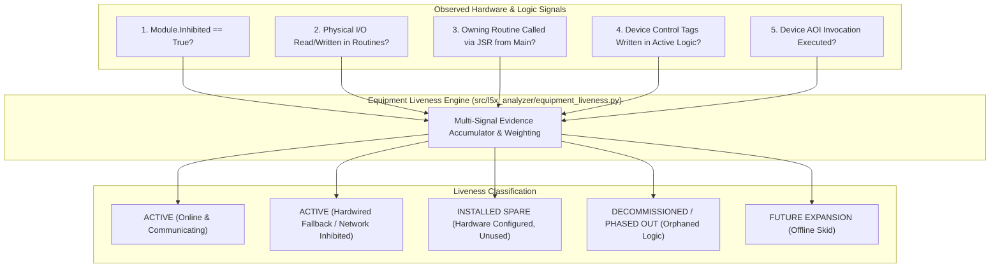

# SPEC-07: Multi-Signal Equipment Liveness Classifier

**Status:** Backlog Target (Feature #6, Issue #27, Rank #6, #17)  
**Priority:** P2 / Medium  
**Subsystem:** `l5x_analyzer` (`src/l5x_analyzer/equipment_liveness.py`)  
**Audit References:** [§16 Equipment-Liveness Audit](file:///home/hello/git/work/studio5000-AI-Assistant/docs/ENGINEERING_AUDIT_2026.md#16-equipment-liveness-reasoning-audit-issue-27), [§26 Ranked Feature #6](file:///home/hello/git/work/studio5000-AI-Assistant/docs/ENGINEERING_AUDIT_2026.md#26-ranked-feature-opportunities)

---

## 1. Problem Statement & Background

In industrial facilities undergoing retrofits, brownfield expansions, or maintenance changes, PLC programs frequently contain disabled, bypassed, or legacy hardware.

A naive inspection algorithm (e.g. checking whether an Ethernet communication module has `Inhibited="true"`) leads to dangerous misclassifications:
- **Scenario A:** A Variable Frequency Drive (VFD) Ethernet module is inhibited because the drive failed and was replaced with **hardwired discrete start/stop and analog speed reference I/O**. Labeling the equipment as "Decommissioned" is false—the motor is actively running.
- **Scenario B:** An entire processing skid was uninstalled, but its routines and modules remain in the project. The routines are orphaned (never called via `JSR`).
- **Scenario C:** A spare I/O module was installed during panel build but never wired or referenced in logic.

---

## 2. Multi-Signal Evidence Model & Rules



### Classification Decision Matrix

| Module Inhibited | Hardware I/O Referenced in Logic | Routine JSR Reachable | Output Tags Written | Classification Outcome | Confidence |
| :---: | :---: | :---: | :---: | :--- | :---: |
| **False** | Yes | Yes | Yes | `ACTIVE_ONLINE` | **High (0.95)** |
| **True** | **Yes (Hardwired Channels Active)** | Yes | Yes | `ACTIVE_HARDWIRED_FALLBACK` | **High (0.90)** |
| **True** | No | **No (Orphaned Routine)** | No | `DECOMMISSIONED` | **High (0.95)** |
| **True** | No | Yes | No | `INHIBITED_OFFLINE_SKID` | **Medium (0.75)** |
| **False** | **No** | N/A | No | `INSTALLED_SPARE` | **High (0.90)** |

---

## 3. Data Structures & MCP Interface Specification

### 3.1 Data Model

```python
from enum import Enum
from dataclasses import dataclass
from typing import List, Dict, Any, Optional

class EquipmentLivenessState(str, Enum):
    ACTIVE_ONLINE = "ACTIVE_ONLINE"
    ACTIVE_HARDWIRED_FALLBACK = "ACTIVE_HARDWIRED_FALLBACK"
    INSTALLED_SPARE = "INSTALLED_SPARE"
    DECOMMISSIONED = "DECOMMISSIONED"
    INHIBITED_OFFLINE = "INHIBITED_OFFLINE"
    UNKNOWN = "UNKNOWN"

@dataclass
class EvidenceSignal:
    signal_type: str        # e.g., "MODULE_INHIBITED", "IO_LOGIC_REFERENCE", "JSR_REACHABLE"
    observed_value: Any
    confidence_weight: float
    description: str
    provenance_location: str # e.g. "HardwareTree:Slot 4", "MainProgram/Conveyor_Rtn:Rung 3"

@dataclass
class EquipmentLivenessResult:
    equipment_tag: str
    module_name: Optional[str]
    classification: EquipmentLivenessState
    confidence: float       # 0.0 to 1.0
    evidence_signals: List[EvidenceSignal]
    explanation: str
    operational_recommendations: List[str]
```

### 3.2 MCP Tool Interface

```json
{
  "name": "audit_equipment_liveness",
  "description": "Performs multi-signal static analysis on PLC hardware modules and device tags to classify whether equipment is actively online, running via hardwired fallback, uninstalled, or an unused spare.",
  "parameters": {
    "type": "object",
    "properties": {
      "file_path": {"type": "string", "description": "Path to L5X or ACD project."},
      "equipment_tag": {"type": "string", "description": "Optional specific tag or module to audit. Audits all hardware if omitted."}
    },
    "required": ["file_path"]
  }
}
```

---

## 4. Testing & Acceptance Criteria

### 4.1 Unit & Fixture Tests (`tests/l5x_analyzer/test_equipment_liveness.py`)
- Test module with `Inhibited="true"` but active hardwired discrete I/O $\rightarrow$ verify classified as `ACTIVE_HARDWIRED_FALLBACK`.
- Test module with `Inhibited="true"` in an uncalled routine $\rightarrow$ verify classified as `DECOMMISSIONED`.
- Test unreferenced spare slot on 1756 rack $\rightarrow$ verify classified as `INSTALLED_SPARE`.

### 4.2 Acceptance Criteria
- Engine outputs clear provenance trails for every signal evaluated.
- Eliminates false "offline" classifications for operating equipment with inhibited communication adapters.
