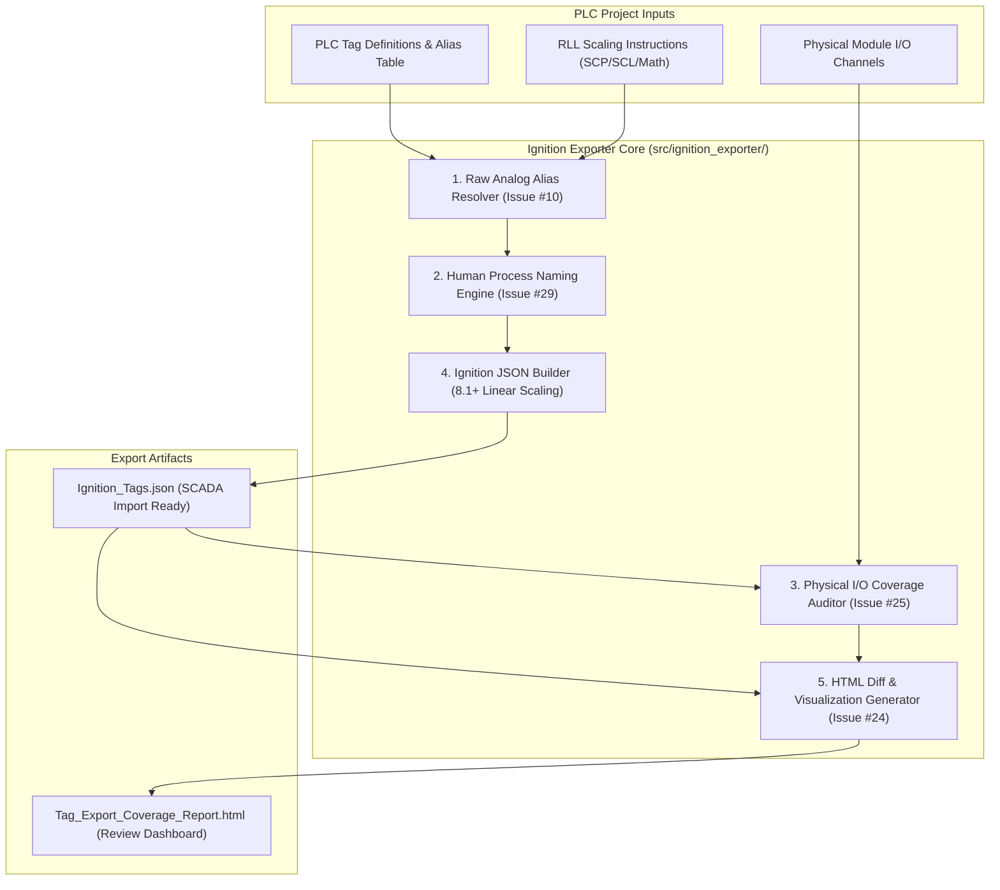

# SPEC-08: SCADA Ignition Export Coverage, Scaling Fallback & Process Naming

**Status:** Backlog Target (Feature #7, Issue #10, Issue #24, Issue #25, Issue #29)  
**Priority:** P1 / High  
**Subsystem:** `ignition_exporter` (`src/ignition_exporter/`)  
**Audit References:** [§15 Ignition Exporter Audit](file:///home/hello/git/work/studio5000-AI-Assistant/docs/ENGINEERING_AUDIT_2026.md#15-ignition-exporter-audit), [§26 Ranked Feature #7](file:///home/hello/git/work/studio5000-AI-Assistant/docs/ENGINEERING_AUDIT_2026.md#26-ranked-feature-opportunities), [§29 Next Actions #8, #21, #22, #23](file:///home/hello/git/work/studio5000-AI-Assistant/docs/ENGINEERING_AUDIT_2026.md#29-top-25-recommended-next-actions)

---

## 1. Problem Statement & Background

The Ignition SCADA Exporter (`src/ignition_exporter/`) converts PLC tags and logic scaling into Ignition 8.1+ standard JSON tag import structures.

Four specific enhancements are required:
1. **Isolated Raw Analog Alias Retention (Issue #10):** When an analog input exists *only* as a raw alias (e.g. `Com_AliasAIn_HWT1_HtC1_Temp`) without an associated scaled engineering tag (`_PV`), current curation logic prunes it or drops its scaling. It must be retained and marked as an unscaled field point.
2. **Human-Readable Process Naming Engine (Issue #29):** Raw PLC abbreviations (`Htr1_Disch_P1_Aux`) need automated mapping into clean hierarchical SCADA node paths (`Heater 1 / Discharge / Pump 1 Aux`).
3. **SCADA I/O Coverage Audit (Issue #25):** Detect discrepancies where physical controller I/O channels are wired in the PLC but omitted from the SCADA tag database, leaving field devices unmonitored.
4. **HTML Visualization & Diff Report (Issue #24):** Generate an interactive visual comparison between an existing Ignition tag export and a newly generated import candidate.

---

## 2. Architectural Design & Enhancements



---

## 3. Detailed Component Specifications

### 3.1 Raw Analog Alias Retention (`src/ignition_exporter/tag_curation.py`)
- In `_collect_export_items()`, check if an analog input tag is an alias pointing to a raw hardware module channel (e.g. `Local:1:I.Ch0Data`).
- Check if any scaled engineering tag (e.g., `*PV`, `*DegF`, `*PSI`, `*GPM`) derives from this raw alias in ladder logic via `find_tag_references` ([SPEC-01](file:///home/hello/git/work/studio5000-AI-Assistant/docs/specs/01-deterministic-ast-cross-reference.md)).
- If no scaled tag exists, **retain the raw alias tag** in the export, configure it under category `field_io`, and set a tag documentation parameter: `"note": "Unscaled raw analog field channel"`.

### 3.2 Human-Readable Naming Engine (`src/ignition_exporter/naming_engine.py`)
Integrate deterministic hierarchy rules from process naming conventions:
- Expand abbreviations: `Htr` $\rightarrow$ `Heater`, `Disch` $\rightarrow$ `Discharge`, `P1` $\rightarrow$ `Pump 1`, `Tnk` $\rightarrow$ `Tank`, `Vlv` $\rightarrow$ `Valve`, `Temp` $\rightarrow$ `Temperature`.
- Build Ignition folder paths by matching equipment unit boundaries:
  - Input: `HWT1_HtC1_Temp_PV`
  - Output Folder: `Hot Water Tank 1 / Heating Circuit 1`
  - Output Tag Name: `Temperature`

### 3.3 Physical I/O Coverage Audit Tool (`src/ignition_exporter/io_coverage.py`)
Add MCP tool `audit_scada_io_coverage`:
- Cross-reference all physical channels in the controller hardware tree against exported SCADA tags.
- Calculate coverage percentage: $\frac{\text{Physical Channels in SCADA}}{\text{Total Configured Physical Channels}} \times 100\%$.
- Flag unmonitored physical inputs/outputs in an audit breakdown.

### 3.4 HTML Visualization & Diff Generator (`src/ignition_exporter/html_reporter.py`)
- Emit a standalone HTML dashboard rendering:
  - Total SCADA tags created by category (`analog_scaled`, `field_io`, `alarm`, `status`, `setpoint`).
  - Interactive searchable table with OPC item paths, scaling limits (`RawMin`/`Max`, `EngMin`/`Max`), and engineering units.
  - Color-coded diff view if comparing against a baseline `tags.json`.

---

## 4. MCP Interfaces

```json
{
  "name": "audit_scada_io_coverage",
  "description": "Cross-checks physical PLC I/O channels against Ignition SCADA tags, flagging unmonitored sensors and output actuators.",
  "parameters": {
    "type": "object",
    "properties": {
      "l5x_file": {"type": "string"},
      "ignition_json_file": {"type": "string"}
    },
    "required": ["l5x_file", "ignition_json_file"]
  }
}
```

---

## 5. Testing & Acceptance Criteria

### 5.1 Unit Tests (`tests/ignition_exporter/test_scada_features.py`)
- Test isolated raw analog alias retention: assert `Com_AliasAIn_HWT1_HtC1_Temp` is not dropped when no `_PV` tag exists.
- Test process naming engine expanding equipment abbreviations into clean nested folder paths.
- Test I/O coverage audit identifying unexported spare I/O channels.

### 5.2 Acceptance Criteria
- Zero raw analog aliases are lost during SCADA export.
- HTML report renders fully standalone without external internet CDN dependencies.
