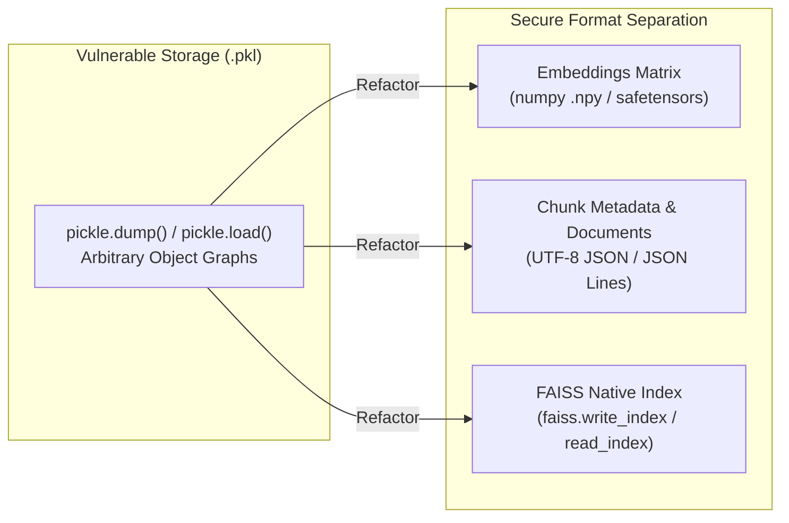

# SPEC-09: Secure Deserialization & Vector Cache Management

**Status:** Backlog / Sprint 1 Target (BUG-05 / Issue #36, Rank #4, #25)  
**Priority:** P1 / High  
**Subsystem:** `security` / `mcp_server`  
**Audit References:** [§6 BUG-05](file:///home/hello/git/work/studio5000-AI-Assistant/docs/ENGINEERING_AUDIT_2026.md#bug-05-p1-insecure-pickleload-on-cache-files-introduces-arbitrary-code-execution-risks), [§20 Security & Confidentiality Audit](file:///home/hello/git/work/studio5000-AI-Assistant/docs/ENGINEERING_AUDIT_2026.md#20-security--confidentiality-audit), [§29 Next Actions #4, #25](file:///home/hello/git/work/studio5000-AI-Assistant/docs/ENGINEERING_AUDIT_2026.md#29-top-25-recommended-next-actions)

---

## 1. Problem Statement & Background

Six modules across the platform deserialize vector database cache files using standard Python `pickle.load()`:
1. `src/documentation/instruction_vector_db.py:354`
2. `src/drawings_analyzer/pdf_vector_db.py:445`
3. `src/l5x_analyzer/l5x_vector_db.py:622`
4. `src/mcp_server/studio5000_mcp_server.py:272`
5. `src/sdk_documentation/sdk_vector_db.py:346`
6. `src/tag_analyzer/tag_vector_db.py:541`

### Security Vulnerabilities:
- **Arbitrary Code Execution (CWE-502):** If an attacker alters a cached `.pkl` file or if `.pkl` files are shared across machines, deserialization via `pickle.load()` executes arbitrary Python code in the host process.
- **Confidentiality / Multi-Tenant Data Leakage:** Customer PLC tag names, machine comments, and routine logic persist in local vector caches (`*_vector_cache/`). There is no automated CLI tool to flush customer data between projects.

---

## 2. Remediation Strategy & Architecture



### 2.1 File Format Standards:
1. **Embedding Tensors:** Persisted via `numpy.save(file, array)` / `numpy.load(file, allow_pickle=False)` or `safetensors`.
2. **Document & Chunk Metadata:** Persisted as standard UTF-8 encoded JSON (`metadata.json`).
3. **FAISS Indices:** Persisted via official C++ native serialization (`faiss.write_index(index, path)` / `faiss.read_index(path)`).

---

## 3. Implementation Details

### 3.1 Secure Cache Manager (`src/mcp_server/cache_manager.py`)

```python
import json
import numpy as np
import faiss
from pathlib import Path
from typing import Tuple, List, Dict, Any

class SecureVectorCache:
    @staticmethod
    def save(
        cache_dir: Path,
        index: faiss.Index,
        embeddings: np.ndarray,
        metadata: List[Dict[str, Any]]
    ) -> None:
        cache_dir.mkdir(parents=True, exist_ok=True)
        # 1. Native FAISS index
        faiss.write_index(index, str(cache_dir / "index.faiss"))
        # 2. Raw numpy embedding array (no pickle)
        np.save(str(cache_dir / "embeddings.npy"), embeddings)
        # 3. JSON metadata
        with open(cache_dir / "metadata.json", "w", encoding="utf-8") as f:
            json.dump(metadata, f, indent=2, ensure_ascii=False)

    @staticmethod
    def load(cache_dir: Path) -> Tuple[faiss.Index, np.ndarray, List[Dict[str, Any]]]:
        index_path = cache_dir / "index.faiss"
        emb_path = cache_dir / "embeddings.npy"
        meta_path = cache_dir / "metadata.json"

        if not (index_path.exists() and emb_path.exists() and meta_path.exists()):
            raise FileNotFoundError(f"Incomplete vector cache in {cache_dir}")

        index = faiss.read_index(str(index_path))
        embeddings = np.load(str(emb_path), allow_pickle=False)
        with open(meta_path, "r", encoding="utf-8") as f:
            metadata = json.load(f)

        return index, embeddings, metadata
```

### 3.2 Cache Cleanup & Invalidation Tool (`src/mcp_server/studio5000_mcp_server.py`)

Add a dedicated cache maintenance tool:
```json
{
  "name": "clear_vector_cache",
  "description": "Securely removes all cached vector indices, embeddings, and metadata from disk to protect customer data confidentiality.",
  "parameters": {
    "type": "object",
    "properties": {
      "cache_type": {
        "type": "string",
        "enum": ["ALL", "L5X", "TAG_CSV", "PDF_DRAWINGS", "DOCS"],
        "default": "ALL"
      }
    }
  }
}
```

---

## 4. Testing & Acceptance Criteria

### 4.1 Unit Tests (`tests/security/test_secure_cache.py`)
- Test saving and loading embeddings with `allow_pickle=False`.
- Verify attempting to load a corrupted or malicious `.pkl` file raises an immediate error without executing arbitrary code.
- Verify `clear_vector_cache` deletes cached files and resets in-memory indices.

### 4.2 Acceptance Criteria
- Zero occurrences of `pickle.load()` or `pickle.dump()` remain in vector database modules.
- CI pipeline security linter (`bandit`) passes with 0 high-severity warnings.
