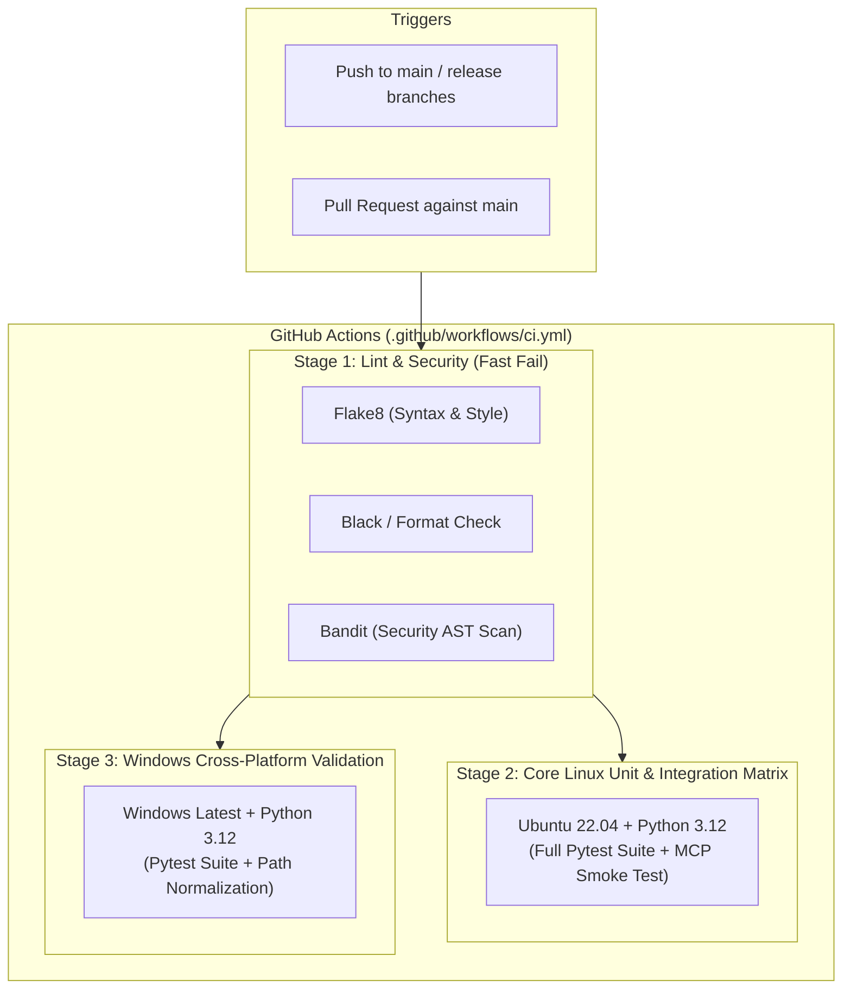

# SPEC-10: Automated CI/CD & Build Infrastructure

**Status:** Backlog / Sprint 1 Target (BUG-10 / Issue #35, Rank #3)  
**Priority:** P1 / High  
**Subsystem:** `ci` (`.github/workflows/ci.yml`)  
**Audit References:** [§6 BUG-10](file:///home/hello/git/work/studio5000-AI-Assistant/docs/ENGINEERING_AUDIT_2026.md#summary-bug-table), [§23 CI & Build Infrastructure Audit](file:///home/hello/git/work/studio5000-AI-Assistant/docs/ENGINEERING_AUDIT_2026.md#23-ci--build-infrastructure-audit), [§26 Ranked Feature #8](file:///home/hello/git/work/studio5000-AI-Assistant/docs/ENGINEERING_AUDIT_2026.md#26-ranked-feature-opportunities)

---

## 1. Problem Statement & Background

The repository currently lacks any continuous integration (CI) workflows in `.github/workflows/`. 

Consequences of zero CI:
1. Pull requests and commits can introduce silent regressions in ACD parsing, L5X AST generation, or comment graph fixed-point iteration.
2. Code formatting, typing defects, and security vulnerabilities (e.g. `pickle.load`) are not caught automatically before merge.
3. Developers working across Linux, macOS, and Windows environments have no centralized validation baseline.

---

## 2. CI Pipeline Architecture



---

## 3. GitHub Actions Workflow Specification

File: `.github/workflows/ci.yml`

```yaml
name: CI Suite

on:
  push:
    branches: [ main ]
  pull_request:
    branches: [ main ]

jobs:
  lint-and-security:
    name: Code Quality & Security Scan
    runs-on: ubuntu-latest
    steps:
      - name: Checkout Code
        uses: actions/checkout@v4

      - name: Set up Python 3.12
        uses: actions/setup-python@v5
        with:
          python-version: '3.12'

      - name: Install Lint & Security Dependencies
        run: |
          python -m pip install --upgrade pip
          pip install flake8 bandit

      - name: Run Flake8 Linter
        run: |
          # Stop the build if there are Python syntax errors or undefined names
          flake8 src tests --count --select=E9,F63,F7,F82 --show-source --statistics
          # Warning checks
          flake8 src tests --count --exit-zero --max-complexity=15 --max-line-length=120 --statistics

      - name: Run Bandit Security Linter
        run: |
          bandit -r src -ll -ii

  test-linux:
    name: Linux Pytest & Smoke Test (Python 3.12)
    needs: lint-and-security
    runs-on: ubuntu-latest
    steps:
      - name: Checkout Code
        uses: actions/checkout@v4

      - name: Set up Python 3.12
        uses: actions/setup-python@v5
        with:
          python-version: '3.12'
          cache: 'pip'

      - name: Install Dependencies
        run: |
          python -m pip install --upgrade pip
          pip install -r requirements.txt
          pip install pytest pytest-cov

      - name: Run Full Pytest Suite
        run: |
          python -m pytest -v --tb=short

      - name: Run MCP Server Smoke Test
        run: |
          python src/mcp_server/studio5000_mcp_server.py --test

  test-windows:
    name: Windows Pytest (Python 3.12)
    needs: lint-and-security
    runs-on: windows-latest
    steps:
      - name: Checkout Code
        uses: actions/checkout@v4

      - name: Set up Python 3.12
        uses: actions/setup-python@v5
        with:
          python-version: '3.12'
          cache: 'pip'

      - name: Install Dependencies
        run: |
          python -m pip install --upgrade pip
          pip install -r requirements.txt
          pip install pytest

      - name: Run Full Pytest Suite on Windows
        run: |
          python -m pytest -v --tb=short
```

---

## 4. Testing & Acceptance Criteria

### 4.1 Local Validation
- Run `flake8` and `bandit` locally and verify clean exit status.
- Ensure all 238+ unit and integration tests pass cleanly under Python 3.12.

### 4.2 Acceptance Criteria
- Workflow executes automatically on PR creation and merge.
- Linux and Windows jobs complete in `< 2.5 minutes`.
- MCP server `--test` flag passes in CI without external hardware requirements.
