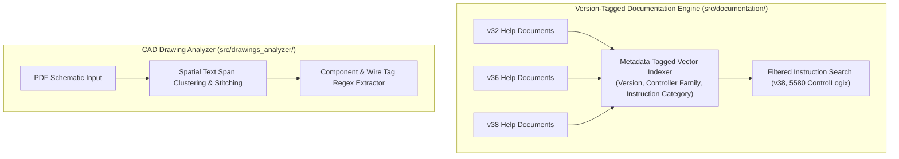

# SPEC-12: Documentation Version Tagging & Engineering Drawing Parser Enhancements

**Status:** Backlog Target (Issue #19, Sections 17, 18, 24, Rank #24)  
**Priority:** P2 / Medium  
**Subsystem:** `documentation`, `drawings_analyzer`  
**Audit References:** [§17 Documentation Search & Grounding Audit](file:///home/hello/git/work/studio5000-AI-Assistant/docs/ENGINEERING_AUDIT_2026.md#17-documentation-search--grounding-audit), [§18 Engineering Drawing Audit](file:///home/hello/git/work/studio5000-AI-Assistant/docs/ENGINEERING_AUDIT_2026.md#18-engineering-drawing-audit), [§24 Documentation Contradictions](file:///home/hello/git/work/studio5000-AI-Assistant/docs/ENGINEERING_AUDIT_2026.md#24-documentation-contradictions--stale-claims)

---

## 1. Problem Statement & Background

Two secondary heuristic subsystems in the platform require architectural refinement:

### 1.1 Documentation Search Deficiencies (§17)
1. **Multi-Version Collisions (Issue #19):** Rockwell Studio 5000 instruction definitions change across major revisions (e.g. v32 vs v36 vs v38). Currently, all documentation is indexed into a single flat vector index, causing search results to mix parameter signatures from different versions.
2. **Missing Controller Family Filtering:** Certain instructions (e.g. `ALMD`, `ALMA`, Motion axes, or GuardLogix Safety instructions) are only valid on specific controller architectures (ControlLogix 5580 / CompactLogix 5380 vs legacy 5570). The search engine cannot filter by target controller family.

### 1.2 Engineering Drawing Analyzer Deficiencies (§18, §24)
1. **"Vision AI" Overstatement:** The repository documentation claims advanced Vision AI analysis of electrical schematics. In reality, `src/drawings_analyzer/pdf_parser.py:349-380` counts vector drawing primitives (`page.get_drawings()`) and formats a template string. The documentation must be aligned with actual capabilities or upgraded with multimodal model hooks.
2. **AutoCAD Electrical Text Span Fragmentation:** In exported CAD drawings, tag labels (e.g. `101-FT-01`) are often fragmented into individual text spans (`"101"`, `"-"`, `"FT"`, `"-"`, `"01"`). The regex extractor misses fragmented tag names.

---

## 2. Technical Enhancements



---

## 3. Implementation Details

### 3.1 Version & Controller Family Filtering (`src/documentation/instruction_vector_db.py`)

Update document chunk metadata schema:
```json
{
  "instruction": "TON",
  "studio_version": "v38",
  "controller_family": ["ControlLogix 5580", "CompactLogix 5380", "ControlLogix 5570"],
  "category": "Timer/Counter",
  "html_path": "Help/ENU/rs5000/ton.htm",
  "text": "Timer On Delay instruction..."
}
```

Update MCP tool `search_instructions`:
```json
{
  "name": "search_instructions",
  "parameters": {
    "type": "object",
    "properties": {
      "query": {"type": "string"},
      "studio_version": {"type": "string", "enum": ["v32", "v35", "v36", "v38", "ALL"], "default": "v38"},
      "controller_family": {"type": "string", "description": "e.g. '5580' or '5380'"}
    },
    "required": ["query"]
  }
}
```

### 3.2 Spatial Text Span Stitching in PDF Schematics (`src/drawings_analyzer/pdf_parser.py`)
- Sort text spans geometrically by vertical coordinate $y_0$ (line baseline) and horizontal coordinate $x_0$.
- Concatenate adjacent spans on the same baseline if the horizontal gap is smaller than the font character width.
- Execute tag extraction regexes against stitched lines rather than isolated text spans.

---

## 4. Testing & Acceptance Criteria

### 4.1 Unit Tests (`tests/test_doc_drawing_features.py`)
- Test searching instruction documentation with `studio_version="v38"` filters out older v32 signatures.
- Test spatial text stitching reconstructing fragmented tag name `"101-FT-01"` from 5 adjacent spans.

### 4.2 Acceptance Criteria
- Instruction search strictly respects Studio 5000 version filters.
- Documentation accurately describes drawing analysis capabilities without unsubstantiated Vision AI claims.
